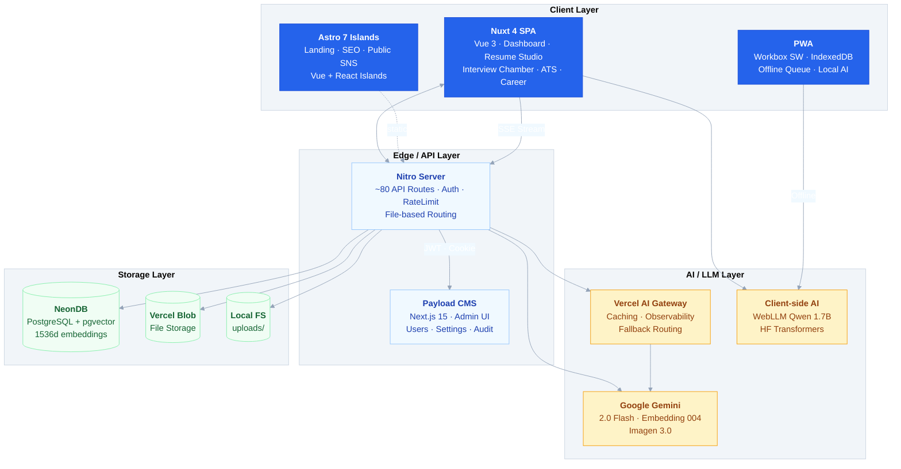

# Kairos: AI-Driven Career Operating System

> **"당신의 커리어 전 생애를 기억하고, 분석하고, 대신 행동하는 AI"**

Kairos는 **Nuxt 4 (SPA)** + **Astro 7 (Islands)** 듀얼 프레임워크 아키텍처로 구축된 AI 기반 커리어 관리 플랫폼입니다. **Google Gemini AI**, **NeonDB (pgvector)**, **Vercel AI Gateway**를 활용하여 이력서 분석/개선, AI 모의면접, ATS 호환성 검사, 문장 휴머나이저, 커리어 시맨틱 검색 등을 제공합니다.

---

## System Architecture



---

## Tech Stack

| Category | Technology |
|---|---|
| **Framework** | Nuxt 4 (Vue 3 SPA) · Astro 7 (Islands) · Nitro Engine |
| **Language** | TypeScript (strict, ESM) · React (Seed Design islands) |
| **AI / LLM** | Google Gemini 2.0 Flash · Vercel AI SDK v7 · AI Gateway |
| **Database** | NeonDB (PostgreSQL) · Drizzle ORM · pgvector (1536d) |
| **Auth** | JWT (jose) · Google OAuth2 · Web3 Wallet (viem) · TOTP MFA |
| **Storage** | Vercel Blob · Local filesystem (HWP/DOCX/PDF) |
| **CMS** | Payload CMS + Next.js 15 + Lexical Editor |
| **Styling** | Seed Design · Tailwind CSS v4 · Freesentation Font |
| **PWA** | Workbox · IndexedDB (idb) · `@vite-pwa/nuxt` |
| **Client AI** | WebLLM (Qwen 1.7B) · HuggingFace Transformers · vectra |
| **i18n** | Korean (default) · English · `@nuxtjs/i18n` |
| **Testing** | Vitest · happy-dom · Vue Test Utils |
| **Deploy** | Vercel (Seoul region) · Docker |
| **Multi-platform** | Tauri v2 (Desktop) · React Native Expo (Mobile) · Chrome/VSCode Extensions |

---

## Database ERD

```mermaid
%%{init: {'theme':'base', 'themeVariables': { 'primaryColor': '#2563eb', 'primaryBorderColor': '#1d4ed8', 'lineColor': '#94a3b8', 'secondaryColor': '#f0f9ff', 'tertiaryColor': '#fef3c7', 'clusterBkg': '#f8fafc', 'clusterBorder': '#e2e8f0', 'nodeBorder': '#475569', 'nodeTextColor': '#1e293b'}}}%%
erDiagram
    users {
        uuid id PK
        varchar email UK
        varchar password_hash
        varchar name
        varchar role "user | admin | manager"
        text avatar_url
        varchar google_id UK
        varchar wallet_address
        varchar mfa_secret
        boolean mfa_enabled
        timestamp created_at
        timestamp updated_at
    }

    resumes {
        uuid id PK
        uuid user_id FK
        varchar title
        text original_content
        text parsed_text
        varchar status "draft | evaluating | improved"
        integer current_score
        timestamp created_at
        timestamp updated_at
    }

    resume_refinements {
        uuid id PK
        uuid resume_id FK
        varchar step "draft | evaluate | improve"
        text draft_content
        jsonb evaluation_feedback
        integer score
        text improved_content
        timestamp created_at
    }

    mock_interviews {
        uuid id PK
        uuid user_id FK
        varchar job_title
        varchar company_name
        varchar difficulty "junior | medium | senior"
        varchar status "in_progress | completed"
        integer overall_score
        text overall_feedback
        timestamp created_at
        timestamp updated_at
    }

    interview_messages {
        uuid id PK
        uuid interview_id FK
        varchar sender "interviewer | candidate"
        text message
        varchar question_type
        jsonb feedback
        timestamp created_at
    }

    ats_analyses {
        uuid id PK
        uuid user_id FK
        varchar job_title
        text job_description
        uuid resume_id FK
        integer match_score
        jsonb missing_keywords
        jsonb found_keywords
        jsonb recommendations
        jsonb detailed_breakdown
        timestamp created_at
    }

    humanized_texts {
        uuid id PK
        uuid user_id FK
        text original_text
        text humanized_text
        integer style_score
        text changes_summary
        timestamp created_at
    }

    qa_sets {
        uuid id PK
        uuid user_id FK
        varchar title
        varchar target_role
        jsonb qa_pairs
        timestamp created_at
    }

    careers {
        uuid id PK
        uuid user_id FK
        varchar company
        varchar role
        varchar period
        text description
        jsonb achievements
        vector embedding "pgvector 1536d"
        timestamp created_at
        timestamp updated_at
    }

    company_meta {
        uuid id PK
        varchar company_name UK
        varchar industry
        integer wlb_score
        integer culture_score
        integer salary_score
        text pros_summary
        text cons_summary
        text ai_insight
        timestamp created_at
    }

    community_posts {
        uuid id PK
        uuid user_id FK
        varchar title
        text content
        varchar category "interview_pass | career_tip | qna"
        integer likes_count
        timestamp created_at
    }

    chat_sessions {
        uuid id PK
        uuid user_id FK
        varchar title
        jsonb messages
        text context
        boolean is_public
        timestamp created_at
        timestamp updated_at
    }

    studio_images {
        uuid id PK
        uuid user_id FK
        varchar type "generated | uploaded"
        text prompt
        text image_url
        integer width
        integer height
        varchar original_file_name
        timestamp created_at
    }

    system_settings {
        uuid id PK
        varchar key UK
        text value
        varchar category "env | feature_flag | llm | storage"
        text description
        boolean is_encrypted
        uuid updated_by FK
        timestamp updated_at
    }

    audit_logs {
        uuid id PK
        uuid user_id FK
        varchar action
        varchar category
        jsonb details
        varchar ip_address
        timestamp created_at
    }

    push_subscriptions {
        uuid id PK
        uuid user_id FK
        text endpoint
        text p256dh
        text auth
        timestamp created_at
    }

    %% Core Domain (User Profile)
    users ||--o{ resumes : "소유"
    users ||--o{ mock_interviews : "응시"
    users ||--o{ ats_analyses : "분석 요청"
    users ||--o{ humanized_texts : "변환"
    users ||--o{ qa_sets : "생성"
    users ||--o{ careers : "경력 등록"
    users ||--o{ community_posts : "작성"
    users ||--o{ chat_sessions : "대화"
    users ||--o{ studio_images : "이미지"
    users ||--o{ push_subscriptions : "구독"

    %% Interview Domain
    mock_interviews ||--o{ interview_messages : "대화 기록"

    %% Resume Domain
    resumes ||--o{ resume_refinements : "개선 이력"
    resumes ||--o{ ats_analyses : "참조"

    %% System Domain
    users ||--o{ audit_logs : "감사 로그"
    system_settings ||--o| users : "수정자"

    %% Company Domain
    careers ||--o{ company_meta : "참조"
```



---

## Service Layer Architecture

```mermaid
%%{init: {'theme':'base', 'themeVariables': { 'primaryColor': '#059669', 'primaryBorderColor': '#047857', 'lineColor': '#94a3b8', 'secondaryColor': '#f0fdf4', 'tertiaryColor': '#dbeafe', 'clusterBkg': '#f8fafc', 'clusterBorder': '#e2e8f0'}}}%%
flowchart LR
    subgraph API["<b>API Routes (~80 handlers)</b>"]
        AUTH["auth/*"]
        RESUME["resumes/*"]
        INTERVIEW["interviews/*"]
        ATS["ats/*"]
        LLM["llm/*"]
        QA["qa/*"]
        HUMAN["humanizer/*"]
        CAREER["careers/*"]
        STUDIO["studio/*"]
        COMMUNITY["community/*"]
        CHAT["chat/*"]
        DOCS["docs/*"]
        COMPANY["company/*"]
        ADMIN["admin/*"]
        MCP["mcp/*"]
    end

    subgraph Services["<b>Service Modules (20)</b>"]
        LLM_SVC["llm.ts · llmCache.ts"]
        GUARD["guardrail.ts 4-layer"]
        RESUME_SVC["resume.ts"]
        INTERVIEW_SVC["interview.ts"]
        ATS_SVC["ats.ts skill taxonomy"]
        QA_SVC["qa.ts"]
        HUMAN_SVC["humanizer.ts"]
        CAREER_SVC["career.ts + embedding.ts"]
        COMPANY_SVC["companyMeta.ts"]
        SKILLGAP["publicSkillGap.ts"]
        PARSER["parser.ts · hwpParser.ts"]
        AUTH_SVC["auth.ts · mfa.ts"]
        BLOB_SVC["blob.ts"]
        SYS_CFG["systemConfig.ts"]
        MCP_SVC["mcp.ts"]
        CTX["context.ts"]
    end

    subgraph Middleware["<b>Middleware</b>"]
        AUTH_MW["auth.ts JWT Session"]
        RATE["rateLimit.ts IP-based"]
    end

    API --> AUTH_MW
    AUTH_MW --> RATE
    RATE --> Services
    Services --> DB[("NeonDB + pgvector")]
    Services --> AI[("Gemini AI")]

    classDef api fill:#3b82f6,color:#fff,stroke:#2563eb
    classDef svc fill:#059669,color:#fff,stroke:#047857
    classDef mw fill:#d97706,color:#fff,stroke:#b45309
    classDef store fill:#7c3aed,color:#fff,stroke:#6d28d9
    class AUTH,RESUME,INTERVIEW,ATS,LLM,QA,HUMAN,CAREER,STUDIO,COMMUNITY,CHAT,DOCS,COMPANY,ADMIN,MCP api
    class LLM_SVC,GUARD,RESUME_SVC,INTERVIEW_SVC,ATS_SVC,QA_SVC,HUMAN_SVC,CAREER_SVC,COMPANY_SVC,SKILLGAP,PARSER,AUTH_SVC,BLOB_SVC,SYS_CFG,MCP_SVC,CTX svc
    class AUTH_MW,RATE mw
    class DB,AI store
```



---

## Multi-Platform Shell Strategy

| Shell | Technology | Features |
|---|---|---|
| **Web** | Nuxt 4 SPA + Astro 7 | PWA · Offline IndexedDB · SSE Streaming |
| **Mobile** | React Native (Expo) | STT/TTS Voice Interview · Secure Store |
| **Desktop** | Tauri v2 (Rust + Webview) | <10MB binary · Native HWP editing |
| **Extension** | Chrome MV3 + VS Code | DOM Parser · Git commit summary |

Core business logic lives in `packages/` and is shared across all shells via platform-specific bridges (`tauri-bridge`, `mobile-bridge`, `agent-cli`).

---

## Features

| Feature | Description | Key Technology |
|---|---|---|
| **Resume Studio** | 3-stage pipeline: Draft → LLM Evaluate → STAR Improve | `resume.ts` · Gemini 2.0 Flash |
| **AI Mock Interview** | Real-time SSE streaming with live feedback | `@ai-sdk/vue` · `interview.ts` |
| **ATS Analyzer** | Keyword matching (80+ skills, 7 categories) | `ats.ts` · Pure algorithm |
| **Text Humanizer** | AI→Human tone conversion with style scoring | `humanizer.ts` · LLM |
| **Q&A Generator** | Role-specific interview Q&A generation | `qa.ts` · LLM Structured |
| **Semantic Career Search** | pgvector 1536-dim cosine similarity | `embedding.ts` · `career.ts` |
| **Company Intelligence** | WLB/Culture/Salary analysis per company | `companyMeta.ts` · LLM |
| **AI Photo Studio** | Google Imagen 3.0 image generation | `studio/*` · `@ai-sdk/google` |
| **Community SNS** | Interview pass / Career tips / Q&A | `community/*` · Public posts |
| **Client-side AI** | WebGPU-accelerated local LLM + embeddings | WebLLM · HuggingFace · vectra |
| **MCP Hub** | Model Context Protocol tools for AI agents | `mcp.ts` · JSON Schema tools |
| **Shareable Chats** | Persistent chat sessions via `/r/:id` | `chat/*` · ISR 60s |

---

## Quick Start

```bash
# Install dependencies
npm install

# Configure environment
cp .env.example .env
# Fill in: DATABASE_URL, GOOGLE_GENERATIVE_AI_API_KEY, JWT_SECRET, etc.

# Run both Nuxt + Astro dev servers
npm run dev

# Or run individually
npm run dev:nuxt   # http://localhost:3000
npm run dev:astro  # http://localhost:4321

# Database commands
npm run db:generate  # Generate Drizzle migrations
npm run db:migrate   # Apply migrations to NeonDB
npm run db:studio    # Launch Drizzle Studio GUI

# Run tests
npm test
npm run test:coverage  # With coverage report
```

---

## Project Structure

```
kairos/
├── app/                    # Nuxt 4 SPA (Vue 3)
│   ├── pages/              # 18 pages (resume, interview, ats, ...)
│   ├── components/         # Navbar, Sidebar, CareerAssistantPanel, ...
│   ├── composables/        # useAuth, useClientAI, useLocalLLM, ...
│   ├── middleware/          # Auth guard
│   ├── plugins/            # Mock interceptor (client-only)
│   ├── utils/              # diff.ts (HTML diff rendering)
│   ├── data/mock/          # 50 mock profiles for demo mode
│   └── assets/css/         # Tailwind CSS v4 + Seed Design
├── server/                 # Nitro API Server
│   ├── api/                # ~80 route handlers (20 groups)
│   ├── services/           # 20 service modules
│   ├── middleware/          # auth.ts, rateLimit.ts
│   └── plugins/            # errorHandler.ts
├── db/                     # Drizzle ORM
│   ├── schema.ts           # 16 table definitions + relations
│   └── index.ts            # NeonDB client singleton
├── packages/               # Shared platform bridges
│   ├── tauri-bridge/       # Desktop Tauri v2 bridge
│   ├── mobile-bridge/      # React Native Expo bridge
│   └── agent-cli/          # Terminal CLI agent
├── apps/astro/             # Astro 7 marketing microsite
│   └── src/                # Vue + React islands
├── seed-design/            # Generated Seed Design React components
├── i18n/                   # ko.json, en.json (253 keys each)
├── public/                 # PWA icons, SVGs, brand assets
├── test/                   # Vitest (9 test files, 561 lines)
├── drizzle/                # SQL migrations
├── docs/                   # Korean documentation (competition, plans)
├── nuxt.config.ts           # Nuxt 4 configuration
├── payload.config.ts        # Payload CMS configuration
├── drizzle.config.ts        # Drizzle ORM configuration
├── vercel.json              # Vercel deployment (Seoul region)
├── vitest.config.ts         # Test configuration
├── tsconfig.json            # TypeScript strict mode
└── .env.example             # 11 required environment variables
```

---

## AI Guardrail System (4-Layer)

| Layer | Function | Description |
|---|---|---|
| L1 | `checkInputGuardrail` | Input validation, max length (4K chars) |
| L2 | `checkContextGuardrail` | Prompt injection detection |
| L3 | `checkOutputAsyncGuardrail` | PII detection (Korean RRN) + auto-sanitization |
| L4 | `checkLoopGuardrail` | Infinite loop prevention (max 3 iterations) |

---

*최종 수정: 2026-07-31 | 프로젝트 메인 README.md*
