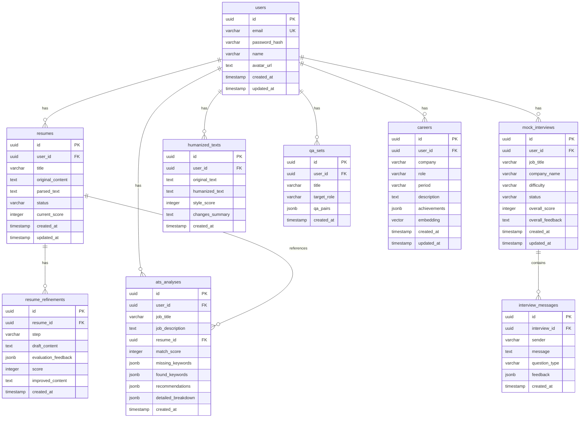

# Kairos: AI-Driven Career Operating System
> **"당신의 커리어 전 생애를 기억하고, 분석하고, 대신 행동하는 AI"**

Kairos는 **Astro(아일랜드 아키텍처)**와 **Nuxt 4(하이브리드 SPA)**를 결합하여 사용자 경험을 고도화하고, **NeonDB(pgvector)**와 **Redis Cloud(시맨틱 캐시)**를 활용하여 저지연 AI 연산을 수행하는 크로스플랫폼 커리어 관리 엔진입니다.

> **기획 및 전략 로드맵 문서 저장소**: [Kairos 기획 특화 저장소 바로가기](./docs/Idea-Real_tion/README.md)  
> 경진대회 PPT 대본, 심사기준 Q&A, 데모 시연 대본은 위 링크를 클릭하여 확인하세요.

---

## 하이브리드 시스템 아키텍처

```
                  ┌────────────────────────────────────────┐
                  │              클라이언트 브라우저       │
                  └──────┬──────────────────────────┬──────┘
                         │ (정적/SNS/SEO)           │ (대시보드/에이전트/CUI)
                         ▼                          ▼
               ┌───────────────────┐      ┌───────────────────┐
               │    Astro Shell    │      │    Nuxt 4 Shell   │
               │ (Islands Arch.)   │      │   (Hybrid SPA)    │
               └─────────┬─────────┘      └─────────┬─────────┘
                         │                          │
                         ├──────────────────────────┤
                         │ (Edge Router / Vercel)   │
                         ▼                          ▼
               ┌────────────────────────────────────────┐
               │         Nitro API Gateway              │
               │  - Better Auth / Rate Limiting (Redis) │
               │  - Model Router (Anthropic SDK v7)     │
               └─────────┬──────────────────────────┬───┘
                         │                          │
                         │ (Session/Cache/Limit)    │ (Data/Vector query)
                         ▼                          ▼
               ┌───────────────────┐      ┌───────────────────┐
               │    Redis Cloud    │      │   Neon Postgres   │
               │ (Upstash / Cache) │      │   (with pgvector) │
               └───────────────────┘      └───────────────────┘
```

*   **Astro (Island Architecture)**: 성능 및 SEO 최적화가 핵심인 랜딩 페이지 및 퍼블릭 SNS 피드(`r/*`). 부분 하이드레이션 적용으로 초기 로드 타임 단축.
*   **Nuxt 4 (Hybrid SPA/SSR)**: 고도화 스튜디오 및 실시간 모의 면접관(SSE 스트리밍) 등 복잡한 실시간 인터랙션 구역 전담.
*   **Neon Database**: PostgreSQL 확장인 `pgvector`를 통해 1536차원 커리어 경험 노드 임베딩 정보의 시맨틱 유사도 검색 수행.
*   **Redis Cloud (Upstash)**: API 오용 제한(Rate Limiting) 및 OpenAI/Claude 중복 호출을 막는 **시맨틱 캐시(Semantic Cache)** 가속.

---

## Database ERD (Entity Relationship Diagram)



---

## Multi-Platform Stack (Core-Shell)

Kairos는 단일 Core 비즈니스 로직(`packages/`)을 중심으로 각 타깃 디바이스에 전용 Shell을 씌워 컴파일하는 모노레포 구조로 기획되었습니다.

*   **Web Shell**: Nuxt 4 SPA + Astro + `@vite-pwa/nuxt` 오프라인 IndexedDB.
*   **Mobile Shell**: React Native (Expo) STT/TTS 모의면접 API 래핑 및 Secure Store 로컬 보안 스토리지 제어.
*   **Desktop Shell**: Tauri v2 (Rust + Webview)를 통한 10MB 이하 초경량 바이너리 배포 및 네이티브 로컬 HWP 조작.
*   **Extension**: Chrome Extension (Manifest V3 DOM 파서) & VS Code (Git commit 성과 요약) 플러그인.

---

## Local Quick Start

```bash
# 1. 의존성 설치 (pnpm 권장)
pnpm install

# 2. 로컬 개발 환경 구성
cp .env.example .env
# .env 내부 데이터베이스(DATABASE_URL) 및 LLM 키 바인딩

# 3. 로컬 엣지 서버 가동
npm run dev

# 4. 도커 컨테이너 실행 (Postgres + pgvector 가속)
docker-compose up --build -d
```

---

*최종 수정: 2026-07-29 | 프로젝트 메인 README.md*
