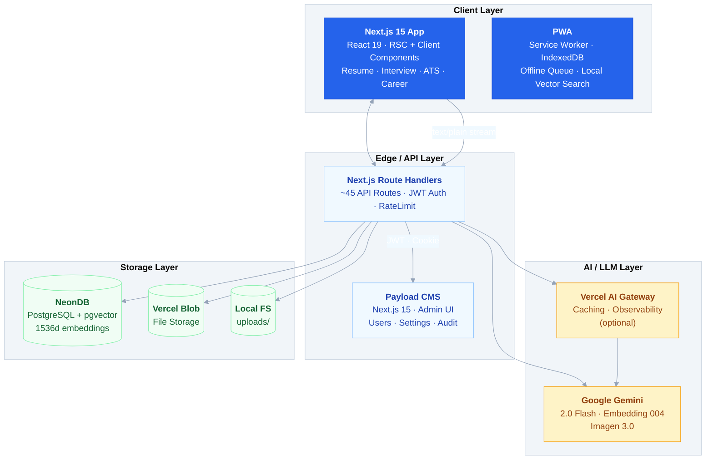
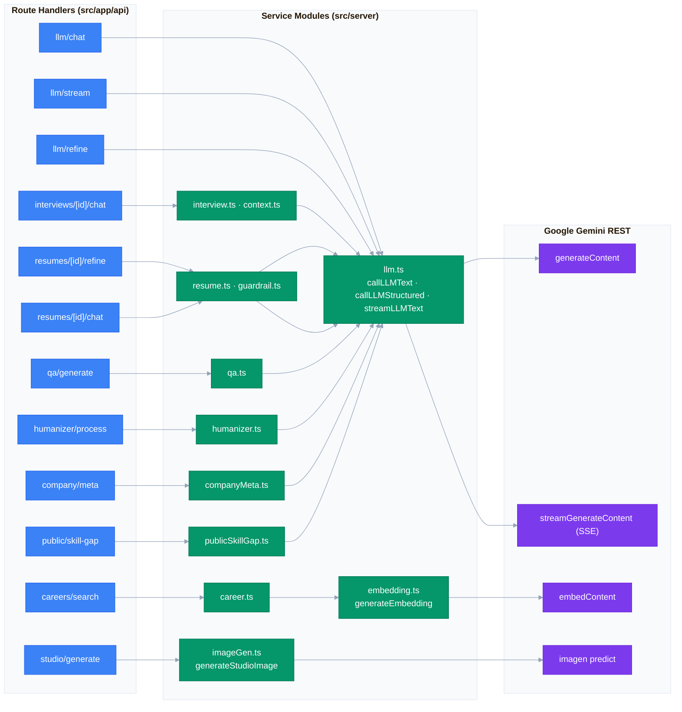

# Kairos: AI-Driven Career Operating System

> **"당신의 커리어 전 생애를 기억하고, 분석하고, 대신 행동하는 AI"**

Kairos는 **Next.js 15 (App Router)** 단일 프레임워크 아키텍처로 구축된 AI 기반 커리어 관리 플랫폼입니다. **Google Gemini API**(직접 REST 구현, AI SDK 미사용), **NeonDB (pgvector)**, **Vercel AI Gateway**를 활용하여 이력서 분석/개선, AI 모의면접, ATS 호환성 검사, 문장 휴머나이저, 커리어 시맨틱 검색 등을 제공합니다.

---

## System Architecture



---

## Tech Stack

| Category | Technology |
|---|---|
| **Framework** | Next.js 15 (App Router) · React 19 |
| **Language** | TypeScript (strict) |
| **AI / LLM** | Google Gemini 2.0 Flash · **직접 REST 구현** (`src/server/llm.ts`) |
| **Database** | NeonDB (PostgreSQL) · Drizzle ORM · pgvector (1536d) |
| **Auth** | JWT (jose) · Google OAuth2 · Web3 Wallet (viem) · TOTP MFA (otplib) |
| **Storage** | Vercel Blob · Local filesystem (HWP/DOCX/PDF) |
| **CMS** | Payload CMS + Next.js 15 + Lexical Editor |
| **Styling** | Seed Design · Tailwind CSS v4 |
| **PWA** | Service Worker · IndexedDB (idb) |
| **Client AI** | vectra (IndexedDB 로컬 벡터 검색) |
| **Testing** | Vitest |
| **Deploy** | Vercel (Seoul region) |
| **Multi-platform** | Tauri v2 (Desktop) · React Native Expo (Mobile) · Chrome/VSCode Extensions |

---

## Database ERD


---

## LLM Architecture (직접 REST 구현)

AI SDK(`ai`, `@ai-sdk/*`)를 사용하지 않고, **Google Gemini REST API를 직접 호출**하는 공용 모듈이 모든 LLM 기능의 유일한 진입점입니다.



핵심: `src/server/llm.ts`가 내보내는 `callLLMText` / `callLLMStructured`(zod → OpenAPI 스키마 → JSON 모드) / `streamLLMText`(SSE 파싱 → `ReadableStream`) 만을 모든 서비스와 라우트가 임포트합니다.

---

## Service Layer Architecture

```mermaid
%%{init: {'theme':'base', 'themeVariables': { 'primaryColor': '#059669', 'primaryBorderColor': '#047857', 'lineColor': '#94a3b8', 'secondaryColor': '#f0fdf4', 'tertiaryColor': '#dbeafe', 'clusterBkg': '#f8fafc', 'clusterBorder': '#e2e8f0'}}}%%
flowchart LR
    subgraph API["<b>API Routes (src/app/api ~45 handlers)</b>"]
        AUTH["auth/*"]
        RESUME["resumes/*"]
        INTERVIEW["interviews/*"]
        ATS["ats/*"]
        LLM["llm/*"]
        QA["qa/*"]
        HUMAN["humanizer/*"]
        CAREER["careers/*"]
        STUDIO["studio/*"]
        COMMUNITY["community/*"]
        CHAT["chat/*"]
        DOCS["docs/*"]
        COMPANY["company/*"]
        ADMIN["admin/*"]
        MCP["mcp/*"]
    end

    subgraph Services["<b>Service Modules (src/server 20+)</b>"]
        LLM_SVC["llm.ts · llmCache.ts"]
        GUARD["guardrail.ts 4-layer"]
        RESUME_SVC["resume.ts"]
        INTERVIEW_SVC["interview.ts · context.ts"]
        ATS_SVC["ats.ts skill taxonomy"]
        QA_SVC["qa.ts"]
        HUMAN_SVC["humanizer.ts"]
        CAREER_SVC["career.ts + embedding.ts"]
        COMPANY_SVC["companyMeta.ts"]
        SKILLGAP["publicSkillGap.ts"]
        PARSER["parser.ts · hwpParser.ts"]
        AUTH_SVC["auth.ts · mfa.ts"]
        BLOB_SVC["blob.ts"]
        SYS_CFG["systemConfig.ts"]
        MCP_SVC["mcp.ts"]
        IMG_SVC["imageGen.ts"]
    end

    subgraph Middleware["<b>Middleware</b>"]
        AUTH_MW["middleware.ts JWT Session"]
        RATE["lib/rateLimit.ts IP-based"]
    end

    API --> AUTH_MW
    AUTH_MW --> RATE
    RATE --> Services
    Services --> DB[("NeonDB + pgvector")]
    Services --> AI[("Gemini API (직접 REST)")]

    classDef api fill:#3b82f6,color:#fff,stroke:#2563eb
    classDef svc fill:#059669,color:#fff,stroke:#047857
    classDef mw fill:#d97706,color:#fff,stroke:#b45309
    classDef store fill:#7c3aed,color:#fff,stroke:#6d28d9
    class AUTH,RESUME,INTERVIEW,ATS,LLM,QA,HUMAN,CAREER,STUDIO,COMMUNITY,CHAT,DOCS,COMPANY,ADMIN,MCP api
    class LLM_SVC,GUARD,RESUME_SVC,INTERVIEW_SVC,ATS_SVC,QA_SVC,HUMAN_SVC,CAREER_SVC,COMPANY_SVC,SKILLGAP,PARSER,AUTH_SVC,BLOB_SVC,SYS_CFG,MCP_SVC,IMG_SVC svc
    class AUTH_MW,RATE mw
    class DB,AI store
```



---

## Multi-Platform Shell Strategy

| Shell | Technology | Features |
|---|---|---|
| **Web** | Next.js 15 App Router | PWA · Offline IndexedDB · Text Stream |
| **Mobile** | React Native (Expo) | STT/TTS Voice Interview · Secure Store |
| **Desktop** | Tauri v2 (Rust + Webview) | <10MB binary · Native HWP editing |
| **Extension** | Chrome MV3 + VS Code | DOM Parser · Git commit summary |

플랫폼별 브리지는 `packages/` (`tauri-bridge`, `mobile-bridge`, `agent-cli`)에 정의되어 있습니다.

---

## Features

| Feature | Description | Key Technology |
|---|---|---|
| **Resume Studio** | 3-stage pipeline: Draft → LLM Evaluate → STAR Improve | `resume.ts` · Gemini 2.0 Flash |
| **AI Mock Interview** | Real-time text streaming with context window + live feedback | `hooks/useChat.ts` · `interview.ts` |
| **ATS Analyzer** | Keyword matching (80+ skills, 7 categories) | `ats.ts` · Pure algorithm |
| **Text Humanizer** | AI→Human tone conversion with style scoring | `humanizer.ts` · LLM Structured |
| **Q&A Generator** | Role-specific interview Q&A generation | `qa.ts` · LLM Structured |
| **Semantic Career Search** | pgvector 1536-dim cosine similarity | `embedding.ts` · `career.ts` |
| **Company Intelligence** | WLB/Culture/Salary analysis per company | `companyMeta.ts` · LLM |
| **AI Photo Studio** | Google Imagen 3.0 image generation | `imageGen.ts` · `studio/*` |
| **Community SNS** | Interview pass / Career tips / Q&A | `community/*` · Public posts |
| **Local Vector Search** | IndexedDB-기반 로컬 임베딩 검색 | vectra · Transformers |
| **MCP Hub** | Model Context Protocol tools for AI agents | `mcp.ts` · JSON Schema tools |
| **Shareable Chats** | Persistent chat sessions via `/r/:id` | `chat/*` |

---

## Quick Start

```bash
# Install dependencies
npm install

# Configure environment
cp .env.example .env
# Fill in: DATABASE_URL, GOOGLE_GENERATIVE_AI_API_KEY, JWT_SECRET, etc.

# Development server
npm run dev            # http://localhost:3000

# Production build & start
npm run build
npm run start

# Database commands
npm run db:generate  # Generate Drizzle migrations
npm run db:migrate   # Apply migrations to NeonDB
npm run db:studio    # Launch Drizzle Studio GUI
```

---

## Project Structure

```
kairos/
├── src/
│   ├── app/                    # Next.js App Router
│   │   ├── page.tsx            # 랜딩 / 대시보드
│   │   ├── presentation/       # AI 서비스톤 발표자료 (10슬라이드)
│   │   ├── (authenticated)/    # resume, interview, ats, humanizer, qa, career, studio, docs, settings, admin
│   │   ├── auth/               # login, register
│   │   ├── r/[id]/             # 공유 AI 채팅
│   │   └── api/                # ~45 Route Handlers
│   ├── components/             # Navbar, Sidebar, RootLayoutClient, ...
│   ├── context/                # AuthContext (JWT + mock 모드)
│   ├── hooks/                  # useAuth, useChat, useDocumentParser, useOfflineQueue, ...
│   ├── lib/                    # toast, rateLimit, mockInterceptor
│   ├── server/                 # Service modules (llm, embedding, imageGen, resume, interview, ...)
│   └── data/mock/              # 데모 모드용 mock DB
├── db/                         # Drizzle ORM (schema.ts 16개 테이블, index.ts)
├── shared/                     # 공용 타입
├── seed-design/                # Seed Design React 컴포넌트
├── public/                     # PWA 아이콘, SVG, 브랜드 에셋
├── test/                       # Vitest (src/server 대상)
├── drizzle/                    # SQL 마이그레이션
├── docs/                       # 한국어 문서 (대회 기획, 심사기준)
├── contracts/                  # Solidity 스마트 컨트랙트
├── payload.config.ts           # Payload CMS 설정
├── drizzle.config.ts           # Drizzle ORM 설정
├── next.config.ts              # Next.js 설정
├── vercel.json                 # Vercel 배포 (Seoul region, next build)
├── vitest.config.ts            # 테스트 설정
├── tsconfig.json               # TypeScript strict mode
└── .env.example                # 환경변수 템플릿
```

---

## AI Guardrail System (4-Layer)

| Layer | Function | Description |
|---|---|---|
| L1 | `checkInputGuardrail` | Input validation, max length (4K chars) |
| L2 | `checkContextGuardrail` | Prompt injection detection |
| L3 | `checkOutputAsyncGuardrail` | PII detection (Korean RRN) + auto-sanitization |
| L4 | `checkLoopGuardrail` | Infinite loop prevention (max 3 iterations) |

---

*최종 수정: 2026-08-01 | Next.js 15 단일 프레임워크 기준 (Nuxt 4 / Nitro / Astro 제거 완료)*
