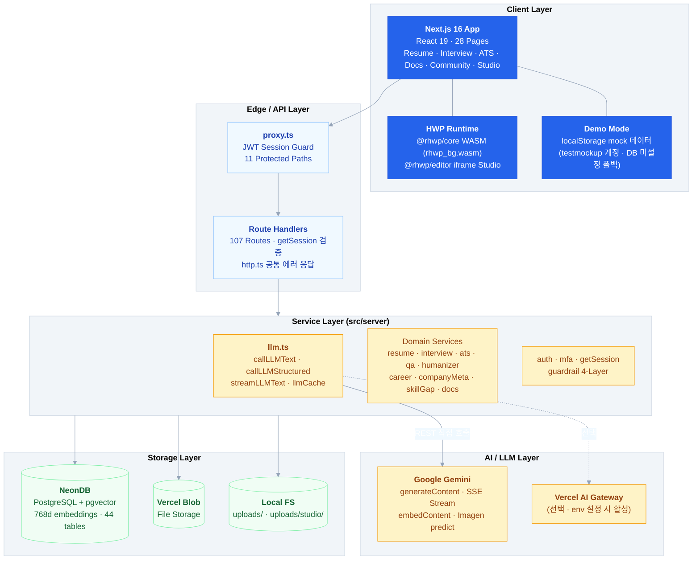
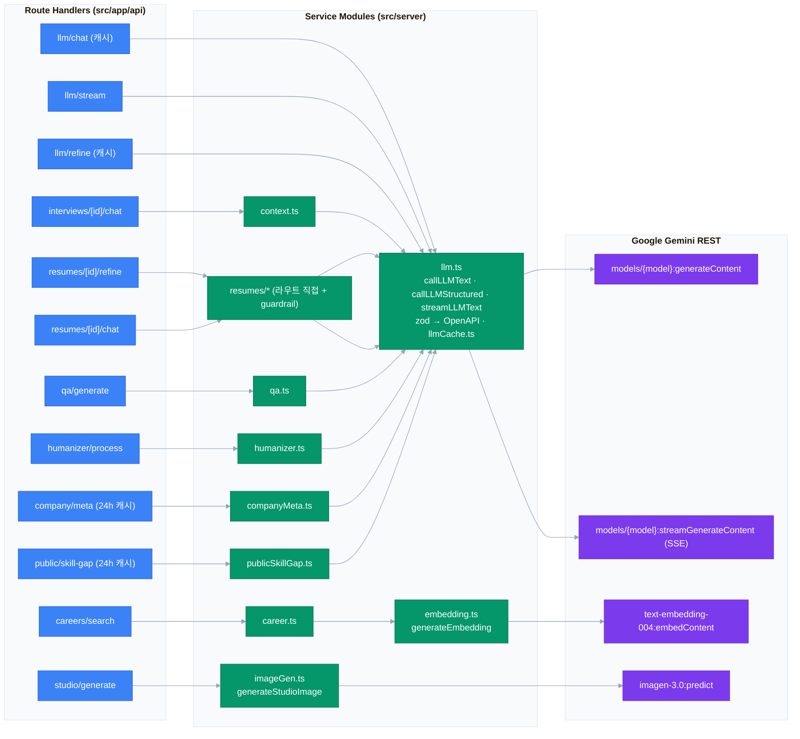

# Kairos: AI-Driven Career Operating System

> **"당신의 커리어 전 생애를 기억하고, 분석하고, 대신 행동하는 AI"**

Kairos는 **Next.js 16 (App Router)** 단일 프레임워크로 구축된 AI 기반 커리어 관리 플랫폼입니다. **Google Gemini REST API를 직접 호출**(AI SDK 미사용)하며, **NeonDB (PostgreSQL + pgvector)**, **Vercel Blob**을 활용해 이력서 분석/개선, AI 모의면접, ATS 호환성 검사, 문장 휴머나이저, 경력 시맨틱 검색, HWP/HWPX 문서 편집 등을 제공합니다.

- **프레임워크**: Next.js 16 (App Router) · React 19 · TypeScript (strict)
- **AI**: Google Gemini 2.0 Flash · text-embedding-004 · Imagen 3.0 (직접 REST 구현)
- **DB**: NeonDB (PostgreSQL + pgvector 768d) · Drizzle ORM
- **문서**: HWP/HWPX 뷰어·에디터 (@rhwp core/editor, WASM)

---

## System Architecture



---

## Tech Stack

| Category | Technology |
|---|---|
| **Framework** | Next.js 16 (App Router) · React 19 · TypeScript (strict) |
| **AI / LLM** | Google Gemini 2.0 Flash · **직접 REST 구현** (`src/server/llm.ts`, AI SDK 미사용) |
| **Embedding** | Google text-embedding-004 (768d, `embedding.ts`) |
| **Image** | Google Imagen 3.0 (`imageGen.ts`, `studio/*`) |
| **Database** | NeonDB (PostgreSQL) · Drizzle ORM · pgvector (768d) |
| **Auth** | JWT (jose, `kairos_session` 쿠키) · Google OAuth2 · Web3 Wallet (viem) · TOTP MFA (otplib + qrcode) |
| **Storage** | Vercel Blob · Local filesystem (uploads/, HWP/DOCX/PDF) |
| **HWP 문서** | @rhwp/core + @rhwp/editor (WASM, 브라우저 전용) · hwplib-js (서버 파싱) |
| **파일 파싱** | pdfjs-dist · mammoth (DOCX) |
| **Styling** | Tailwind CSS v4 (CSS-first, @theme) · Freesentation 폰트 |
| **Validation** | zod (LLM 구조화 응답 스키마) |
| **UI 유틸** | sonner (토스트) · diff (단어 diff 렌더) |
| **Testing** | Vitest (35개 테스트 파일 · 193 tests) |
| **Deploy** | Vercel (icn1 서울 리전) · `.npmrc` legacy-peer-deps |

---

## Current Code Snapshot (2026-08-04)

- **Schema tables**: `db/schema.ts`의 `export const ... = pgTable(...)` 기준 **44개**.
- **API routes**: `src/app/api/**/route.ts` 파일 기준 **107개**.
- **Pages**: `src/app/**/page.tsx` 파일 기준 **28개**.
- **Tests**: `test/**/*.test.ts` **35개 파일**, Vitest 테스트 케이스 **193개**.
- 위 수치는 생성된 `.next` 산출물이 아니라 현재 소스 파일을 센 값이며, 최신 `npm test` 결과 35개 파일·193개 통과와 일치한다.
- 현재 `db/schema.ts`와 `src/server/embedding.ts`의 임베딩 차원은 **768d**이며, `drizzle/0006_clumsy_lake.sql`은 기존 경력 임베딩을 무효화하고 `vector(768)`로 변경한다.

---

## Core Features

| Feature | Description | Key Module |
|---|---|---|
| **Resume Studio** | 3단계 파이프라인: Draft → LLM 평가 → STAR 개선 (diff 뷰 + 대화형 AI 에이전트) | `resume/*` · `llm.ts` |
| **AI Mock Interview** | 컨텍스트 윈도우 + plain-text SSE 스트리밍 면접관, 실시간 평가 | `interview/*` · `context.ts` · `useChat.ts` |
| **ATS Analyzer** | JD 키워드 매칭 (40개 스킬 분류, 카테고리 가중치, 순수 알고리즘) | `ats.ts` |
| **Text Humanizer** | AI 문체 → 자연 한국어 변환 + 문체 점수 | `humanizer.ts` · LLM Structured |
| **Q&A Generator** | 직무별 면접 질문/모범답변 세트 생성 | `qa.ts` · LLM Structured |
| **Career Semantic Search** | pgvector 768d 코사인 유사도 경력 검색 | `embedding.ts` · `career.ts` |
| **Context Sea** | 사용자 동의 기반 파일 import·Notion/GitHub·공공 API sync·검색·JSON/Markdown export | `contexts.ts` · `privateProviders.ts` · `publicProviders.ts` |
| **Career Diary** | 경력 일기 CRUD와 목표·직무 탐색에 사용하는 계정 소유 기록 | `careerPlanning.ts` · `career-diary/*` |
| **Agent Workspace** | local-only draft/rewrite/summarize/diff, artifact version·restore·feedback | `agentWorkspace.ts` · `workspace/*` |
| **Community Matching** | 공개 가능한 career record 기반 유사도 매칭과 게시글 CRUD | `communityMatches.ts` · `community/*` |
| **Company Intelligence** | 회사 WLB/문화/연봉 분석 (24h 캐시) | `companyMeta.ts` |
| **AI Photo Studio** | Imagen 3.0 이미지 생성 + 업로드 갤러리 | `imageGen.ts` · `studio/*` |
| **HWP/HWPX 문서** | 서버 텍스트 추출(업로드 영속화) · 웹 뷰어(SVG 페이지) · 웹 에디터(저장) | `HwpViewer.tsx` · `HwpEditor.tsx` · `hwpParser.ts` |
| **Shareable Chat** | 채팅 세션 저장 → `/r/:id` 공개 공유 | `chat/*` |
| **MCP Manifest** | AI 에이전트용 MCP 도구 매니페스트 (외부 클라이언트용) | `mcp.ts` |

---

## LLM Architecture (직접 REST 구현)

AI SDK(`ai`, `@ai-sdk/*`)를 사용하지 않고, **Google Gemini REST API를 직접 호출**하는 `src/server/llm.ts`가 모든 LLM 기능의 유일한 진입점입니다. zod 스키마를 OpenAPI `responseSchema`로 변환해 JSON 모드 구조화 응답을 받습니다.



핵심: `src/server/llm.ts`가 내보내는 `callLLMText` / `callLLMStructured`(zod → OpenAPI 스키마 → JSON 모드) / `streamLLMText`(SSE 파싱 → `ReadableStream`) 만을 모든 서비스와 라우트가 임포트합니다. `llmCache.ts`(인메모리 TTL 캐시)는 `llm/chat`, `llm/refine`, `company/meta`에 적용됩니다. 설정 해석은 DB(`systemSettings`) → env 폴백 순이며, `VERCEL_AI_GATEWAY_URL` 설정 시 Vercel AI Gateway 경유가 활성화됩니다 (기본값은 Gemini 직결).

---

## Service Layer Architecture

```mermaid
%%{init: {'theme':'base', 'themeVariables': { 'primaryColor': '#059669', 'primaryBorderColor': '#047857', 'lineColor': '#94a3b8', 'secondaryColor': '#f0fdf4', 'tertiaryColor': '#dbeafe', 'clusterBkg': '#f8fafc', 'clusterBorder': '#e2e8f0'}}}%%
flowchart LR
    subgraph API["<b>API Routes (src/app/api · 107 handlers)</b>"]
        AUTH["auth/*"]
        RESUME["resumes/*"]
        INTERVIEW["interviews/*"]
        ATS["ats/analyze"]
        LLM["llm/*"]
        QA["qa/*"]
        HUMAN["humanizer/*"]
        CAREER["careers/*"]
        STUDIO["studio/*"]
        COMMUNITY["community/*"]
        CHAT["chat/*"]
        DOCS["docs/*"]
        FILES["files/* (uploads 서빙)"]
        COMPANY["company/meta"]
        ADMIN["admin/*"]
        MCP["mcp/manifest"]
        AGENT["agent-orchestration · agent-runs/* · workspaces/* · artifacts/*"]
        APPROVALS["tool-approvals/*"]
        CONTEXT["contexts/* · memory-exports/*"]
        PROVIDERS["providers"]
        SANDBOX["sandbox/*"]
    end

    subgraph Services["<b>Service Modules (src/server · 54 files)</b>"]
        LLM_SVC["llm.ts · llmCache.ts"]
        GUARD["guardrail.ts 4-Layer"]
        RESUME_SVC["resumes/* (라우트 직접)"]
        INTERVIEW_SVC["context.ts"]
        ATS_SVC["ats.ts skill taxonomy"]
        QA_SVC["qa.ts"]
        HUMAN_SVC["humanizer.ts"]
        CAREER_SVC["career.ts + embedding.ts"]
        COMPANY_SVC["companyMeta.ts"]
        SKILLGAP["publicSkillGap.ts"]
        PARSER["parser.ts · hwpParser.ts"]
        AUTH_SVC["auth.ts · mfa.ts · getSession.ts"]
        BLOB_SVC["blob.ts"]
        SYS_CFG["systemConfig.ts"]
        MCP_SVC["mcp.ts"]
        IMG_SVC["imageGen.ts"]
        HTTP["http.ts (공통 에러 헬퍼)"]
        PROVIDER_SVC["providers/* · providerConfig.ts"]
        SANDBOX_SVC["sandbox/*"]
    end

    subgraph Middleware["<b>Proxy</b>"]
        AUTH_MW["proxy.ts<br/>JWT Session (kairos_session)"]
    end

    API --> AUTH_MW
    API --> Services
    Services --> DB[("NeonDB + pgvector")]
    Services --> AI[("Gemini API (직접 REST)")]

    classDef api fill:#3b82f6,color:#fff,stroke:#2563eb
    classDef svc fill:#059669,color:#fff,stroke:#047857
    classDef mw fill:#d97706,color:#fff,stroke:#b45309
    classDef store fill:#7c3aed,color:#fff,stroke:#6d28d9
    class AUTH,RESUME,INTERVIEW,ATS,LLM,QA,HUMAN,CAREER,STUDIO,COMMUNITY,CHAT,DOCS,FILES,COMPANY,ADMIN,MCP,AGENT,APPROVALS,CONTEXT,PROVIDERS,SANDBOX api
    class LLM_SVC,GUARD,RESUME_SVC,INTERVIEW_SVC,ATS_SVC,QA_SVC,HUMAN_SVC,CAREER_SVC,COMPANY_SVC,SKILLGAP,PARSER,AUTH_SVC,BLOB_SVC,SYS_CFG,MCP_SVC,IMG_SVC,HTTP,PROVIDER_SVC,SANDBOX_SVC svc
    class AUTH_MW mw
    class DB,AI store
```



- **페이지 인증**: `proxy.ts`가 11개 경로(`/resume`, `/interview`, `/ats`, `/humanizer`, `/qa`, `/career`, `/studio`, `/docs`, `/community`, `/settings`, `/admin`)를 보호합니다.
- **API 인증**: 각 라우트가 `getSession(req)`으로 JWT를 개별 검증합니다.
- **공통 응답**: `http.ts`의 `unauthorized` / `badRequest` / `notFound` / `serviceUnavailable` / `internalError` 헬퍼로 통일합니다.

---

## Database ERD

Drizzle ORM 기반 **44개 테이블** (NeonDB PostgreSQL + pgvector 768d). `DATABASE_URL` 미설정 시 DB 커넥션이 `null`이 되고 앱은 데모 모드로 동작합니다.

```mermaid
%%{init: {'theme':'base', 'themeVariables': { 'primaryColor': '#2563eb', 'primaryBorderColor': '#1d4ed8', 'lineColor': '#94a3b8', 'secondaryColor': '#f0f9ff', 'tertiaryColor': '#fef3c7', 'clusterBkg': '#f8fafc', 'clusterBorder': '#e2e8f0', 'nodeBorder': '#475569', 'nodeTextColor': '#1e293b'}}}%%
erDiagram
    users {
        uuid id PK
        varchar email UK
        varchar password_hash
        varchar name
        varchar role "user | admin | manager"
        text avatar_url
        varchar google_id UK
        varchar wallet_address
        varchar mfa_secret
        boolean mfa_enabled
        timestamp created_at
        timestamp updated_at
    }

    resumes {
        uuid id PK
        uuid user_id FK
        varchar title
        text original_content
        text parsed_text
        varchar status "draft | evaluating | improved"
        integer current_score
        timestamp created_at
        timestamp updated_at
    }

    resume_refinements {
        uuid id PK
        uuid resume_id FK
        varchar step "draft | evaluate | improve"
        text draft_content
        jsonb evaluation_feedback
        integer score
        text improved_content
        timestamp created_at
    }

    mock_interviews {
        uuid id PK
        uuid user_id FK
        varchar job_title
        varchar company_name
        varchar difficulty "junior | medium | senior"
        varchar status "in_progress | completed"
        integer overall_score
        text overall_feedback
        timestamp created_at
        timestamp updated_at
    }

    interview_messages {
        uuid id PK
        uuid interview_id FK
        varchar sender "interviewer | candidate"
        text message
        varchar question_type
        jsonb feedback
        timestamp created_at
    }

    ats_analyses {
        uuid id PK
        uuid user_id FK
        varchar job_title
        text job_description
        uuid resume_id FK
        integer match_score
        jsonb missing_keywords
        jsonb found_keywords
        jsonb recommendations
        jsonb detailed_breakdown
        timestamp created_at
    }

    humanized_texts {
        uuid id PK
        uuid user_id FK
        text original_text
        text humanized_text
        integer style_score
        text changes_summary
        timestamp created_at
    }

    qa_sets {
        uuid id PK
        uuid user_id FK
        varchar title
        varchar target_role
        jsonb qa_pairs
        timestamp created_at
    }

    careers {
        uuid id PK
        uuid user_id FK
        varchar company
        varchar role
        varchar period
        text description
        jsonb achievements
        vector embedding "pgvector 768d"
        timestamp created_at
        timestamp updated_at
    }

    company_meta {
        uuid id PK
        varchar company_name UK
        varchar industry
        integer wlb_score
        integer culture_score
        integer salary_score
        text pros_summary
        text cons_summary
        text ai_insight
        timestamp created_at
    }

    community_posts {
        uuid id PK
        uuid user_id FK
        varchar title
        text content
        varchar category "interview_pass | career_tip | qna"
        integer likes_count
        timestamp created_at
    }

    chat_sessions {
        uuid id PK
        uuid user_id FK "nullable"
        varchar title
        jsonb messages
        text context
        boolean is_public
        timestamp created_at
        timestamp updated_at
    }

    studio_images {
        uuid id PK
        uuid user_id FK
        varchar type "generated | uploaded"
        text prompt
        text image_url
        integer width
        integer height
        varchar original_file_name
        timestamp created_at
    }

    system_settings {
        uuid id PK
        varchar key UK
        text value
        varchar category "env | feature_flag | llm | storage"
        text description
        boolean is_encrypted
        uuid updated_by FK
        timestamp updated_at
    }

    audit_logs {
        uuid id PK
        uuid user_id FK
        varchar action
        varchar category
        jsonb details
        varchar ip_address
        timestamp created_at
    }

    push_subscriptions {
        uuid id PK
        uuid user_id FK
        text endpoint
        text p256dh
        text auth
        timestamp created_at
    }

    %% Core Domain
    users ||--o{ resumes : "소유"
    users ||--o{ mock_interviews : "응시"
    users ||--o{ ats_analyses : "분석 요청"
    users ||--o{ humanized_texts : "변환"
    users ||--o{ qa_sets : "생성"
    users ||--o{ careers : "경력 등록"
    users ||--o{ community_posts : "작성"
    users ||--o{ chat_sessions : "대화"
    users ||--o{ studio_images : "이미지"
    users ||--o{ push_subscriptions : "구독"
    users ||--o{ audit_logs : "감사 로그"

    %% Interview Domain
    mock_interviews ||--o{ interview_messages : "대화 기록"

    %% Resume Domain
    resumes ||--o{ resume_refinements : "개선 이력"
    resumes ||--o{ ats_analyses : "참조"

    %% System Domain
    system_settings ||--o| users : "수정자 (set null)"
```



모든 FK는 `onDelete: cascade` (단, `systemSettings.updatedBy`는 `set null`).

---

## AI Guardrail System (4-Layer)

| Layer | Function | Description |
|---|---|---|
| L1 | `checkInputGuardrail` | 입력 검증 · 최대 길이 제한 |
| L2 | `checkContextGuardrail` | 프롬프트 인젝션 감지 |
| L3 | `checkOutputAsyncGuardrail` | PII 감지 (주민번호) + 자동 마스킹 |
| L4 | `checkLoopGuardrail` | 무한 루프 방지 (최대 3회 반복) |

---

## HWP / HWPX 문서 지원 (@rhwp)

| 기능 | 구현 |
|---|---|
| **서버 텍스트 추출** | `src/server/hwpParser.ts` (hwplib-js) — 업로드/파싱 라우트, 추출 텍스트를 메타데이터 `textContent`로 영속화 |
| **클라이언트 추출** | `src/lib/hwpTextExtract.ts` (@rhwp/core WASM) — 뷰어/미리보기 |
| **웹 뷰어** | `src/components/HwpViewer.tsx` — @rhwp/core SVG 페이지 렌더, 페이지네이션 (`/docs/[id]`) |
| **웹 에디터** | `src/components/HwpEditor.tsx` — @rhwp/editor iframe 임베드, HWP/HWPX 저장 → 업로드 API (`/docs/edit`) |
| **WASM 바이너리** | `scripts/copy-rhwp.mjs` (postinstall) → `public/rhwp_bg.wasm` (gitignore) |

- 에디터 스튜디오 URL은 `NEXT_PUBLIC_RHWP_STUDIO_URL`로 셀프호스팅 지정 가능 (기본: 공개 데모 — 기밀 문서는 배포 시 env 설정 필수).

---

## Auth & Sessions

| 방식 | 구현 |
|---|---|
| **Email / Password** | bcryptjs 해시 · 로그인 시 `kairos_session` JWT 쿠키 발급 (jose HS256, 7일) |
| **Google OAuth2** | `/api/auth/google` → 콜백에서 코드 교환 + 사용자 upsert |
| **Web3 Wallet** | `/api/auth/nonce` 논스 발급 → viem 서명 검증 (`/api/auth/wallet`) |
| **TOTP MFA** | otplib + QR 코드 (`/api/auth/mfa/*`, UI는 향후 확장용) |
| **미들웨어** | `proxy.ts`가 `kairos_session` 검증, 11개 보호 경로 (`middleware.ts` → `proxy.ts` 마이그레이션, Next 16), `JWT_SECRET` 미설정 시 개발 모드 통과 |

---

## Demo Mode (Mock)

- `DATABASE_URL` 미설정 → `db` 커넥션이 `null` → 데모 모드 (mock 데이터 폴백).
- 로그인 페이지에서 `testmockup / 12345` 계정으로 데모 로그인 가능 — `src/data/mock/mockup.ts`의 `generateProfiles()`가 localStorage에 50명 프로필을 시드합니다.
- 데모 전용 시뮬레이션: `CareerAssistantPanel` (가짜 3단계 thinking + 하드코딩 응답), `getSimulatedLLMResponse()` (키워드 분기 응답).

---

## Quick Start

```bash
# Install dependencies (legacy-peer-deps 활성화: .npmrc)
npm install

# Configure environment
cp .env.example .env
# 필수: GOOGLE_GENERATIVE_AI_API_KEY, DATABASE_URL, JWT_SECRET, NEXT_PUBLIC_APP_URL
# 선택: GOOGLE_CLIENT_ID/SECRET, BLOB_READ_WRITE_TOKEN, VERCEL_AI_GATEWAY_URL/KEY,
#       NEXT_PUBLIC_RHWP_STUDIO_URL

# Development server
npm run dev            # http://localhost:3000

# Production build & start
npm run build
npm run start

# Database commands
npm run db:generate  # Generate Drizzle migrations
npm run db:migrate   # Apply migrations to the configured PostgreSQL database
npm run db:studio    # Launch Drizzle Studio GUI

# Tests
  npm test             # Vitest · 193 tests (35개 파일)
```

### Local PostgreSQL

로컬 개발에서는 PostgreSQL 16과 `pgvector` 확장을 설치·실행하고, 빈 데이터베이스를 만든 뒤 `.env`의 `DATABASE_URL`을 실제 로컬 사용자·비밀번호·데이터베이스명으로 설정합니다. 이후 `npm run db:migrate`를 실행해 `drizzle/` 마이그레이션을 적용합니다.

### Environment Variables (`.env.example`)

| Group | Keys |
|---|---|
| **Required** | `GOOGLE_GENERATIVE_AI_API_KEY`, `DATABASE_URL`, `JWT_SECRET`, `NEXT_PUBLIC_APP_URL` |
| **Google OAuth2** (선택) | `GOOGLE_CLIENT_ID`, `GOOGLE_CLIENT_SECRET` |
| **Vercel Blob** (선택) | `BLOB_READ_WRITE_TOKEN` |
| **HWP Editor Studio** (선택) | `NEXT_PUBLIC_RHWP_STUDIO_URL` |
| **Vercel AI Gateway** (선택) | `VERCEL_AI_GATEWAY_URL`, `VERCEL_AI_GATEWAY_KEY` |
| **Model providers** (선택) | `AI_DEFAULT_MODEL_PROVIDER`, `OPENROUTER_*`, `OLLAMA_*`, `LLAMACPP_*`, `GENERIC_OPENAI_*`, `PROVIDER_ALLOWED_HOSTS` |
| **External agent runtimes** (선택, server-only) | `HERMES_*`, `OPENCLAW_*`, `OPENCODE_*`, `PROVIDER_ALLOW_PRIVATE_NETWORK` |
| **Sandbox control-plane** (선택, server-only) | `SANDBOX_BACKEND`, `SANDBOX_FIRECRACKER_ENDPOINT`, `SANDBOX_FIRECRACKER_TOKEN`, `SANDBOX_WINDOWS_*` |

---

## Project Structure

```
kairos/
├── src/
│   ├── app/                    # Next.js App Router
│   │   ├── layout.tsx          # 루트 레이아웃 (AuthProvider → RootLayoutClient)
│   │   ├── page.tsx            # 랜딩 / 대시보드 (인증 분기)
│   │   ├── (authenticated)/    # resume, interview, ats, humanizer, qa, career, studio, docs, community, settings, admin
│   │   ├── auth/               # login, register
│   │   ├── r/[id]/             # 공유 AI 채팅 뷰어
│   │   ├── presentation/       # Next.js 발표 페이지 (별도)
│   │   ├── error.tsx           # 전역 에러 바운더리 (재시도 + digest)
│   │   ├── loading.tsx         # 전역 로딩 스켈레톤
│   │   └── api/                # 107 Route Handlers
│   ├── components/             # 12개 클라이언트 컴포넌트 (Navbar, Sidebar, Skeleton, HwpViewer, HwpEditor, ...)
│   ├── context/                # AuthContext (JWT + 데모 모드)
│   ├── hooks/                  # useChat, useDocumentParser
│   ├── lib/                    # toast, mockInterceptor, hwpTextExtract, nav (내비게이션 단일 소스)
│   ├── server/                 # 서비스·adapter·sandbox 모듈 54개 (llm, providers, sandbox, ats, qa, ...)
│   ├── data/                   # presentationSlides.tsx · mock/ (데모 프로필)
│   ├── utils/                  # diff.ts (단어 단위 diff HTML)
│   └── proxy.ts                # JWT 세션 가드 (Next 16 proxy, middleware.ts 대체)
├── db/                         # Drizzle ORM (schema.ts 44테이블, index.ts)
├── shared/                     # 공용 타입 (User, AuthResponse)
├── packages/                   # 플랫폼 브리지 목 스텁 (tauri-bridge, mobile-bridge, agent-cli)
├── public/                     # 브랜드 SVG 7종 · rhwp_bg.wasm (postinstall 산출물)
├── scripts/                    # copy-rhwp.mjs (WASM 복사)
├── test/                       # Vitest · 테스트 35파일 · 193 tests
├── drizzle/                    # SQL 마이그레이션
├── next.config.ts · vercel.json · drizzle.config.ts · vitest.config.ts · tsconfig.json
├── seed-design.json            # Seed Design CLI 설정 (컴포넌트 미생성)
└── .env.example                # 환경변수 템플릿
```

---

## Multi-Platform Bridges (Stubs)

`packages/` 아래 플랫폼별 브리지가 목(mock) 스텁으로 정의되어 있습니다 (tsconfig exclude).

| Package | Target | Status |
|---|---|---|
| `packages/tauri-bridge` | Tauri v2 (Desktop) · HWP 파서 FFI | Mock 스텁 |
| `packages/mobile-bridge` | React Native (Expo) · STT/TTS | Mock 스텁 |
| `packages/agent-cli` | CLI 에이전트 시뮬레이션 | Mock 스텁 |

---

## SLLM, VM, and External Agent Runtime Adapters

- `src/server/agentWorkspace.ts`의 workspace 작업은 여전히 **local-only** 결정론적 작업(`draft`, `rewrite`, `summarize`, `diff`)이며 `web-fetch`는 unsupported, `shell`은 disabled다. 별도의 `src/app/api/agent-orchestration` 경로는 provider adapter를 선택한다.
- `src/server/providers/types.ts`는 `model`과 `external-agent`를 `kind`로 구분한다. 모델 provider는 Gemini·OpenRouter·Ollama/llama.cpp·Generic OpenAI-compatible이고, Hermes·OpenClaw·OpenCode는 **external agent runtime adapter**다. `agentRouter.ts`의 provider ID가 같아 보여도 이 두 kind를 혼동하지 않는다.
- SLLM/SLM의 현재 adapter 범위는 Ollama 또는 llama.cpp local endpoint와 OpenAI-compatible model endpoint의 text·structured·stream·health 계약이다. 파인튜닝, 가중치 배포, GPU provisioning은 구현 범위가 아니다.
- `src/server/providers/`는 provider 설정, URL 정책, auth, timeout·output limit, JSON schema 검증, Gemini native adapter, OpenAI-compatible adapter, 세 external runtime adapter를 구현한다. license metadata는 설명용이고 `manualReviewRequired: true`이며 라이선스 승인을 자동으로 하지 않는다.
- 원격 endpoint·필수 key·allowlist·`*_ENABLED=true`가 충족되지 않으면 provider config의 `enabled`가 false가 되고 adapter를 호출하지 않는다. provider 목록 health는 `not-applicable`, 호출은 `CONFIGURATION_REQUIRED`가 되며 orchestration은 가능한 경우 local-deterministic로 fallback한다.
- `src/server/sandbox/`는 사용자의 재구현 요청에 따른 VM control-plane adapter다. `disabled`, `remote-firecracker`, `windows-sandbox` 세 backend와 job 상태·취소·만료·capability 조회를 제공한다.
- `remote-firecracker`는 Linux 서버에서 HTTPS endpoint와 token이 모두 구성될 때만 `remote-adapter`로 available이 된다. 지원 action은 `structured-read`, `structured-write`, `structured-transform`이며 임의 code·shell·PowerShell·Node 실행은 거부한다.
- `windows-sandbox`는 `.wsb` 설정 생성·검증만 하는 `config-only` backend이고 자동 실행하지 않는다. 현재 기본값 `SANDBOX_BACKEND=disabled`이며 endpoint가 없으면 sandbox job은 `disabled`와 `SANDBOX_NOT_CONFIGURED`를 반환한다.
- sandbox network 기본 정책은 none이고 allowlist만 허용하며 input 128KB, timeout 100~120,000ms, output 1~1MB 경계를 적용한다. write·external 작업은 tool approval과 audit를 거친다.
- remote endpoint가 없거나 health/configuration 검증이 끝나지 않으면 SLLM·VM·외부 runtime을 완전 실행했다고 설명하지 않는다. 현재 저장소에서 원격 Firecracker 실행 성공이나 실제 외부 runtime 운영 결과를 검증한 것은 아니다.

| Runtime | Official URL | Upstream license | Kairos 분류 및 경계 |
|---|---|---|---|
| Hermes Agent | [공식 사이트](https://hermes-agent.nousresearch.com/) · [공식 저장소](https://github.com/NousResearch/hermes-agent) · [LICENSE](https://github.com/NousResearch/hermes-agent/blob/main/LICENSE) | MIT | `kind: external-agent`; `HERMES_ENABLED`, allowlisted base URL, server key가 없으면 disabled |
| OpenClaw | [공식 사이트](https://openclaw.ai/) · [공식 저장소](https://github.com/openclaw/openclaw) · [LICENSE](https://github.com/openclaw/openclaw/blob/main/LICENSE) | MIT | `kind: external-agent`; local endpoint·gateway token이 없으면 disabled, upstream host tool 권한은 위임하지 않음 |
| OpenCode | [공식 사이트](https://opencode.ai/) · [공식 저장소](https://github.com/anomalyco/opencode) · [LICENSE](https://github.com/anomalyco/opencode/blob/dev/LICENSE) | MIT | `kind: external-agent`; coding capability와 bearer/basic auth가 없으면 disabled |

- 위 MIT 표기는 upstream 저장소의 라이선스이며 Kairos adapter 코드, 연결 대상 서비스의 이용약관, 모델·도구·데이터 라이선스를 대체하지 않습니다.
- 외부 runtime은 신뢰 경계 밖의 프로세스로 취급합니다. adapter는 allowlist endpoint, 서버 전용 인증값, 요청 크기·timeout·output 제한, 사용자 소유 workspace, 읽기·쓰기·외부 전송 승인, 결과 검증 및 hash 기반 audit을 거친 뒤에만 호출합니다.
- 외부 runtime에 Kairos DB, 세션 쿠키, 원문 개인정보, 임의 shell, 임의 VM, 임의 outbound network를 직접 넘기지 않습니다. upstream이 host tool 또는 sandbox를 제공하더라도 Kairos의 최소권한 정책을 별도로 적용합니다.
- Hermes 보안 문서: <https://hermes-agent.nousresearch.com/docs/user-guide/security> · OpenClaw 보안 문서: <https://docs.openclaw.ai/gateway/security> · OpenCode 보안 정책: <https://github.com/anomalyco/opencode/blob/dev/SECURITY.md>

---

## Presentation Visual Language and Attribution

- 정적 발표자료 `발표자료/index.html`의 브랜드 포인트 색은 CSS `--brand: #2F20F7`이며, `--blue-950`, `--blue-700`, `--blue-500`, `--blue-100`을 함께 사용한 blue visual language다. 로고·아이덴티티 원본은 `ASSETS/kairoslogo_basic자산 5.svg`, `ASSETS/kairos_identity_ki.pdf`다.
- glass 효과는 `.glass-surface`와 `.source-chrome` 같은 유틸리티 표면에만 적용한다. `backdrop-filter`를 지원하지 않는 환경에서는 불투명 fallback을 사용한다.
- 3D 표현은 외부 3D asset이 아니라 CSS `perspective`, `transform-style: preserve-3d`, `hero-orb`, `product-frame`으로 만든다.
- motion은 슬라이드 전환 240ms, 진행 막대 220ms, hero orb drift 24초이며 `prefers-reduced-motion`에서 transition·animation을 최소화한다.
- stock image는 현재 덱에 사용하지 않는다. ``는 로컬 Kairos 로고이고, 시연 미디어는 사용자가 선택하는 GIF·MP4·PNG 슬롯 3개다. 저장소에 실제 stock 또는 시연 미디어 파일은 없으므로 파일을 추가할 때마다 출처와 이용 허가를 기록한다.
- Freesentation source: <https://github.com/projectnoonnu/2404>. 해당 저장소 페이지에서 별도 LICENSE 파일을 확인하지 못했으므로 재배포·번들 전 라이선스 확인을 실행 과제로 둔다.
- SUIT source 및 SIL Open Font License 1.1 안내: <https://github.com/sun-typeface/SUIT> · <https://scripts.sil.org/OFL>
- 제3자 폰트·이미지·미디어는 루트 `NOTICE`와 `LICENSING.md`의 원칙대로 각자의 저작권·라이선스·귀속 조건을 별도로 따른다.

---

## Competition Materials Status

| 심사 항목 | 배점 |
|---|---:|
| 문제 정의 | 15 |
| 기대 효과 | 15 |
| 창의성 | 20 |
| 기술구현 및 완성도 | 40 |
| 발표 | 10 |
| 합계 | **100** |

- 공식 10장 순서는 `AI_서비스톤_발표자료양식.md`의 표지, 서비스 개요, 문제 배경 및 타깃 사용자, 주요 기능, 사용자 이용 흐름, AI·SW 활용 구조, 프로토타입 또는 시연 화면, 기대효과 및 확장계획, Q & A, 제출 전 확인사항이다.
- 루트 정적 덱 `발표자료/index.html`은 현재 `<section class="slide">` **14장**이며, Q&A는 11/14, Appendix A·B·C는 12/14~14/14에 있다. 14장 전체는 정적 증거·부록 덱이고, 본문 대본은 공식 10장 순서를 기준으로 한다.
- 정적 덱에는 ATS·Diff 승인·텍스트 면접용 GIF·MP4·PNG 교체 슬롯이 각각 1개씩 있다. 미디어가 없으면 구조화 mock이 남으며, 이를 실시간 또는 실제 AI 결과로 말하지 않는다.
- 공식 10장 순서와 현재 14장 DOM 순서를 최종 제출물에서 일치시키는 작업, 제출 전 확인사항의 실제 슬라이드 매핑, 실제 GIF 파일의 출처·라이선스 등록은 아직 실행 과제다.

## Deployment

- **Vercel**: `vercel.json` — `next build`, 서울 리전 `icn1` 단일 배포, API 캐시 방지 + 보안 헤더.
- **`next.config.ts`**: `serverExternalPackages` (drizzle-orm, @neondatabase/serverless, bcryptjs, jose), `outputFileTracingRoot` 루트 기준.
- **보안 헤더**: `X-Content-Type-Options`, `X-Frame-Options: DENY`, `Referrer-Policy`.
- **`public/rhwp_bg.wasm`** 은 postinstall 산출물로 gitignore 처리 — 클론 직후 `npm install`이 필요합니다.

---

*최종 수정: 2026-08-05 | 코드 인벤토리 44 tables · 107 API routes · 28 pages · 35 test files / 193 tests 기준*
