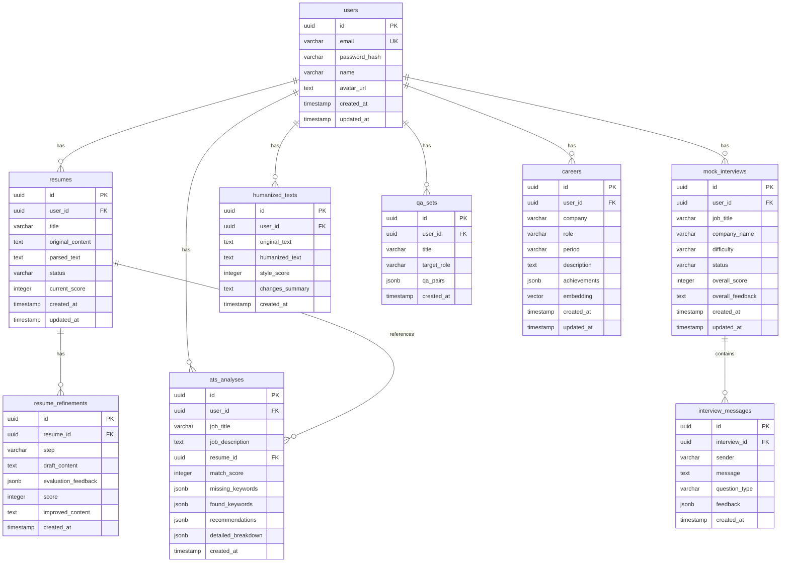

# Kairos | AI Job-Application Preparation Platform

> **Kairos (카이로스)** - *"당신의 시간에 의미를 부여하는 단 하나의 청지기(Dispensator)"*

Kairos는 **TypeScript-only**, **Nuxt 4 (SSR+API)**, **Drizzle ORM**, **PostgreSQL + pgvector**, 그리고 **Vercel AI SDK**를 기반으로 구축된 최첨단 AI 취업 준비 및 커리어 매니지먼트 플랫폼입니다.

---

## 🌟 Key Features (주요 기능)

1. **Auth & Session Management**: Nuxt Auth Utils 및 JWT 기반의 보안 인증 파이프라인.
2. **Resume Refinement Chain (비동기 이력서 고도화)**: `Draft` 생성 $\rightarrow$ `Evaluate` (객관적 LLM 평가) $\rightarrow$ `Improve` (STAR 기법 기반 고도화 재작성) 비동기 체인.
3. **AI Mock Interview via SSE Streaming**: 실시간 Server-Sent Events 스트리밍 기술로 끊김 없는 일대일 꼬리질문 모의면접 및 세부 답변 피드백 제공.
4. **ATS Analysis Engine**: 채용공고(JD) 대비 키워드 매칭률, 기술/경력 세부 점수 및 ATS 합격률 측정.
5. **AI Humanizer**: 정형화되거나 진부한 AI 작성 문체를 감쪽같이 자연스러운 전문 인간 작성 어조로 변환.
6. **Tailored Q&A Generation**: 지원 직무 및 경력 맞춤형 예상 질문과 최고 수준 모범 답안 플래시카드 생성.
7. **Career Management & pgvector Semantic Search**: 1536 차원 고성능 벡터 임베딩 기반의 시맨틱 유사도 검색 탐색.
8. **Document Parsing Engine**: `pdf.js` 및 `mammoth` 라이브러리로 PDF/DOCX 이력서 파일 텍스트 자동 파싱.
9. **Graceful Demo Fallback Engine (DB-Free)**: 로컬 DB 연동이 설정되지 않았거나 오프라인인 환경에서도 인증, 이력서 고도화, 모의 면접, ATS 분석, AI Humanizer, Q&A 생성이 중단 없이 가상 데이터로 가동되는 데모 시스템 탑재.

---

## 🛠️ Tech Stack & Architecture

- **Framework**: Nuxt 4 (Compatibility v4, SSR + Integrated Nitro API Routes)
- **Runtime & Language**: Node.js 22 / Bun (End-to-End TypeScript)
- **Database & ORM**: PostgreSQL with `pgvector` extension, Drizzle ORM (`db/schema.ts` 단일 파일)
- **AI Engine**: Vercel AI SDK (`ai`, `@ai-sdk/openai`, `@ai-sdk/anthropic`, `@ai-sdk/google` 멀티 프로바이더 폴백 지원)
- **UI & Styling**: Nuxt UI, Tailwind CSS, 글래스모피즘(Glassmorphism) 다크 테마 디자인 시스템
- **Deployment**: Docker Multi-stage 빌드 컨테이너 및 Vercel 서버리스 플랫폼 즉시 배포 지원

---

## 🚀 Vercel Deployment (Vercel에 바로 배포하기)

Vercel은 Nuxt 4 애플리케이션 빌드를 기본적으로 감지하여 제로 구성(Zero-config) 서버리스 엣지 함수 환경으로 완벽하게 배포합니다.

### 배포 방법
1. **GitHub 연동**: 본 프로젝트 저장소를 GitHub에 푸시한 뒤, Vercel Dashboard에서 **New Project**로 임포트합니다.
2. **Framework Preset**: 자동으로 `Nuxt.js`가 감지됩니다. 감지되지 않을 경우 프레임워크 프리셋을 `Nuxt`로 설정합니다.
3. **환경변수 설정 (Environment Variables)**:
   - `JWT_SECRET`: 세션 암호화용 임의의 난수 텍스트
   - `OPENAI_API_KEY`, `ANTHROPIC_API_KEY`, `GOOGLE_GENERATIVE_AI_API_KEY` 중 보유한 AI API 키 입력
   - `DATABASE_URL`: Supabase, Neon 등 외부 PostgreSQL + pgvector를 연동할 경우 연결 문자열을 설정합니다. (입력하지 않으면 기본 데모 모드로 자동 폴백 가동되어 DB 없이 가상 목업 데이터로 가동됩니다.)
4. **Deploy 클릭**: 빌드가 수행된 후 고성능 엣지 서버 상에 Kairos 플랫폼이 즉시 실행됩니다.

> [!NOTE]
> Vercel 무료 플랜은 서버리스 함수 실행 시간이 최대 10초로 제한되므로, AI 스트리밍 또는 무거운 분석 체인 구동 시 타임아웃이 날 수 있습니다. 이 경우 AI 모델을 가벼운 `gpt-4o-mini` 등으로 세팅하거나 Vercel Pro 플랜(60초 타임아웃)의 적용을 고려하시기 바랍니다.

---

## 🚀 Local Quick Start & Installation

### 1. 의존성 설치
```bash
npm install
```

### 2. 환경 변수 파일 생성 (`.env`)
```bash
cp .env.example .env
# 생성된 .env 파일을 편집하여 보유하고 계신 AI API 키 및 데이터베이스 설정을 기입하세요.
```

### 3. 로컬 DB 실행 및 마이그레이션 (선택사항)
```bash
# Drizzle Kit으로 스키마 생성 및 푸시
npm run db:push
```

### 4. 로컬 개발 서버 실행
```bash
npm run dev
# http://localhost:3000 에서 즉시 접속 가능합니다.
```

### 5. 도커 단일 컨테이너 빌드 & 실행
```bash
docker-compose up --build -d
```

---

## 📂 Project Structure

```text
Kairos-1/
├── app/
│   ├── assets/css/main.css      # Glassmorphism Design Tokens & Dark Theme
│   ├── app.vue                  # Global Layout Frame & Page Entrypoint
│   ├── components/              # Navbar, Sidebar, StatCard UI Components
│   └── pages/                   # Index Dashboard, Auth, Resume, Interview, ATS, Humanizer, QA, Career
├── db/
│   ├── schema.ts                # Single Schema File (Users, Resumes, MockInterviews, ATS, Careers, pgvector)
│   └── index.ts                 # Drizzle ORM PostgreSQL Client Connection
├── server/
│   ├── api/                     # H3 Nitro API Route Handlers (Auth, Resumes, Interviews, ATS, Humanizer, Careers)
│   ├── middleware/              # Auth JWT Session Verification Middleware
│   └── services/                # Business Logic Services (LLM Fallback, Embeddings, Document Parser, Domain Engines)
├── Dockerfile                   # Multi-stage Single Container Build
├── docker-compose.yml           # PostgreSQL + pgvector & Kairos App Stack
├── nuxt.config.ts               # Nuxt 4 Configuration
├── package.json                 # Project Definition (explicitly named 'kairos')
└── README.md                    # Project Documentation
```

---

## 📊 Database ERD (Entity Relationship Diagram)



