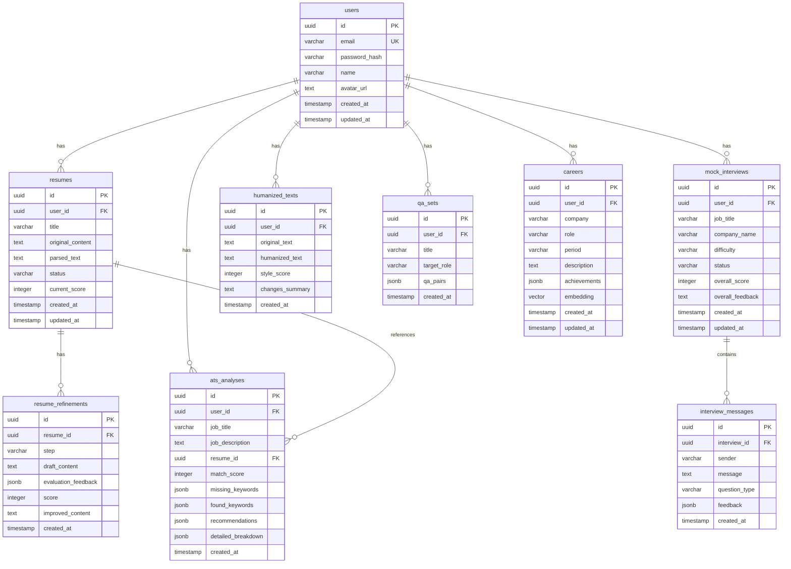

# Kairos | AI Job-Application Preparation Platform

> **Kairos (카이로스)** — *"크리티컬 케이(kairos)가 곧 합격의 순간입니다."*

Kairos는 **Nuxt 4 SPA + Serverless**, **Better Auth**, **Drizzle ORM + Neon PostgreSQL + pgvector**, 그리고 **Vercel AI SDK v7**을 기반으로 하는 **클라이언트-사이드 AI 취업 준비 플랫폼**입니다.

---

## 🌟 Key Features (주요 기능)

1. **Auth & Session Management**: BFF(Backend-for-Frontend) 패턴의 **Better Auth** HttpOnly 쿠키 기반 세션. 브라우저는 세션 토큰에 접근 불가.
2. **Resume Refinement Chain (비동기 이력서 고도화)**: `Draft` → `Evaluate` (LLM 객체 평가) → `Improve` (STAR 기법 기반 재작성). Anthropic **prompt cache**로 90% 입력 비용 절감.
3. **AI Mock Interview via SSE**: 실시간 Server-Sent Events 스트리밍으로 끊김 없는 꼬리질문 모의면접 및 단계별 피드백.
4. **ATS Analysis Engine**: JD 대비 키워드 매칭률 + **클라이언트-사이드 키워드 추출**으로 기본 점수, 서버 LLM으로 심층 분석.
5. **AI Humanizer**: 정형화된 AI 문체를 자연스러운 인간 어조로 변환. 상투적 표현 자동 제거.
6. **Tailored Q&A Generation**: 지원 직무 및 경력 맞춤형 예상 질문 + 모범 답안 플래시카드.
7. **Career Management & pgvector Semantic Search**: 1536차원 벡터 임베딩 + pgvector Cosine Similarity 검색.
8. **Client-Side Document Parsing**: `pdf.js` + `mammoth`를 브라우저에서 직접 실행. **서버 API 호출 불필요**.
9. **Client-Side Vector Search (PWA)**: `vectra/browser` + `IndexedDBStorage`로 로컬 벡터 검색. 오프라인 작동.
10. **Rate Limiting**: Upstash Redis 기반 슬라이딩 윈도우 레이트 리밋 (일반 30/10s, LLM 10/60s).
11. **Graceful Demo Mode**: DB 연동 없이도 모든 AI 기능이 목업 데이터로 가동. 환경변수만으로 즉시 데모 가능.

---

## 🛠️ Tech Stack & Architecture

| Layer | Technology | Version |
|-------|-----------|---------|
| **Framework** | Nuxt 4 (SPA, Compatibility v4) | `^4.5.1` |
| **Runtime** | Node.js 22 / Bun | — |
| **UI** | Nuxt UI v4 + Tailwind CSS v4 | `^4.10.0` |
| **PWA** | @vite-pwa/nuxt + Service Worker | `^1.1.1` |
| **Auth** | Better Auth (BFF, HttpOnly Cookie) | `^1.6.25` |
| **Database ORM** | Drizzle ORM + drizzle-kit | `^0.45.2` / `^0.31.10` |
| **Database** | Neon PostgreSQL (Serverless) + pgvector | — |
| **AI SDK** | Vercel AI SDK v7 | `^7.0.32` |
| **LLM Providers** | OpenAI (GPT-4.1), Anthropic (Claude 4.5/4.6), Google (Gemini 3.5 Flash) | — |
| **Browser AI** | @huggingface/transformers v4 (임베딩, 분류) | `^4.2.0` |
| **Browser Vector** | vectra/browser (IndexedDB 기반) | `^0.15.0` |
| **Browser Parser** | pdfjs-dist v6 + mammoth v1 | ✅ |
| **Rate Limit** | @upstash/ratelimit + @upstash/redis | `^2.0.8` |
| **Cache** | Anthropic prompt cache + Upstash Redis | ✅ |
| **Deployment** | Vercel Serverless / Docker | — |

> **아키텍처 원칙**: SPA 우선 (`ssr: false`), 클라이언트 연산 극대화 (PDF 파싱, 임베딩, ATS 키워드, 벡터 검색), 서버리스 DB (Neon scale-to-zero), LLM 비용 최적화 (프롬프트 캐시 + 모델 라우팅).

---

## 🚀 Vercel Deployment

Vercel은 Nuxt 4 애플리케이션을 제로 구성 서버리스 환경에 배포합니다.

### 배포 방법
1. **GitHub 연동**: 저장소 푸시 후 Vercel Dashboard → **New Project**.
2. **Framework Preset**: 자동 `Nuxt.js` 감지.
3. **환경변수 설정**:
   - `ANTHROPIC_API_KEY`, `OPENAI_API_KEY`, `GOOGLE_GENERATIVE_AI_API_KEY` 중 하나 이상
   - `DATABASE_URL`: **Neon** 등 서버리스 PostgreSQL (없으면 데모 모드)
   - `UPSTASH_REDIS_REST_URL`, `UPSTASH_REDIS_REST_TOKEN`: 레이트 리밋 (없으면 미적용)
4. **Deploy 클릭**.

---

## 🚀 Local Quick Start

```bash
# 1. 의존성 설치
npm install

# 2. 환경변수
cp .env.example .env
# .env 파일에 AI API 키 등 설정

# 3. 개발 서버 실행 (DB 불필요 — 데모 모드)
npm run dev

# 4. Docker (PostgreSQL + pgvector 포함)
docker-compose up --build -d
```

---

## 📂 Project Structure

```
Kairos/
├── app/
│   ├── assets/css/main.css      # Tailwind v4 + Glassmorphism Design Tokens
│   ├── app.vue                  # Root Layout (UApp)
│   ├── components/              # Navbar, Sidebar, ShareButton, Reusable UI
│   ├── composables/             # Client AI Services
│   │   ├── useClientAI.ts       #   @huggingface/transformers 임베딩/분류
│   │   ├── useLocalATS.ts       #   로컬 ATS 키워드 매칭
│   │   ├── useDocumentParser.ts #   브라우저 PDF/DOCX 파싱
│   │   ├── useLocalVectorSearch.ts # vectra/browser IndexedDB
│   │   ├── useLocalLLM.ts       #   WebLLM (선택적 로컬 추론)
│   │   ├── useAuth.ts           #   Better Auth 클라이언트
│   │   ├── useChatHistory.ts    #   IndexedDB 대화 기록
│   │   └── useOfflineQueue.ts   #   오프라인 요청 큐
│   └── pages/                   # Dashboard, Auth, Resume, Interview, ATS, Humanizer, QA, Career
├── db/
│   ├── schema.ts                # 단일 스키마 (8개 테이블 + pgvector)
│   └── index.ts                 # Neon Serverless Drizzle Client
├── server/
│   ├── api/                     # H3 Nitro API 라우트
│   │   ├── auth/                #   Better Auth (login, register, me)
│   │   ├── llm/                 #   LLM (chat, refine, stream)
│   │   └── ...                  #   resumes, interviews, ats, humanizer, qa, careers
│   ├── middleware/
│   │   ├── auth.ts              #   Better Auth 세션 검증
│   │   └── rateLimit.ts         #   Upstash Rate Limiting
│   ├── services/
│   │   ├── llm.ts               #   AI SDK v7 + 모델 라우팅 + Anthropic cacheControl
│   │   ├── llmCache.ts          #   Redis 시맨틱 캐시
│   │   └── ...                  #   resume, interview, ats, humanizer, qa, career, parser, embedding
│   └── auth.ts                  # Better Auth 설정 (Drizzle Adapter)
├── shared/types.ts              # Vue/Nitro 공유 타입
├── nuxt.config.ts               # Nuxt 4 Configuration (SPA, PWA, routeRules)
├── docker-compose.yml           # PostgreSQL + pgvector + Kairos App
├── vercel.json                  # Vercel 설정
└── drizzle/                     # Drizzle 마이그레이션 파일
```

---

## 📊 Database ERD (Entity Relationship Diagram)


