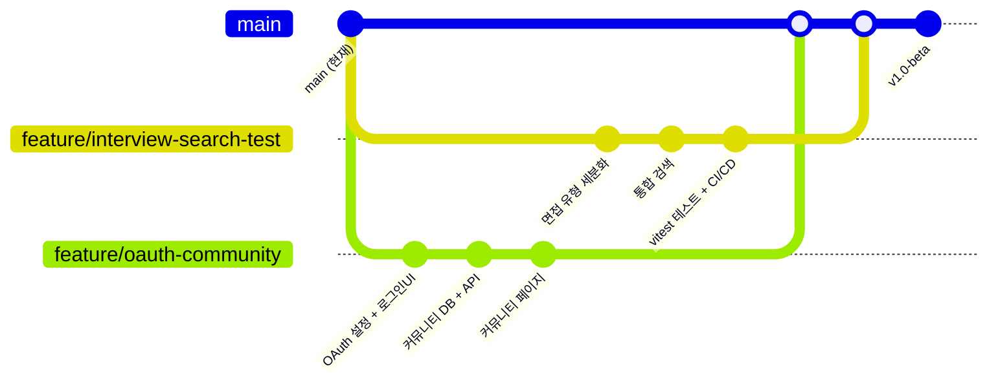

# 📋 Kairos 1차 본격 협업 안내

> **작성일**: 2026-07-29  
> **대상**: 본인(Owner) + 동료 1인 (총 2인 팀)  
> **목표**: MASTER_PLAN 기준 잔여 기능 최대한 빠르게 완성  
> **기반 브랜치**: `main` (seed-design 머지 완료, s6 전 기능 포함)

---

## 1. 현재 진행률

| 구분 | 완료 | 미완료 |
|------|:----:|:------:|
| **Phase 0-8** (인프라) | 100% | 0% |
| **P1-P10** (프로덕션 갭) | 100% | 0% |
| **s6 vision** (신규 6종) | 100% | 0% |
| **task.md Phase 1-6** | 100% | 0% |
| **Sprint 1** (긴급 버그) | 100% | 0% |
| **Sprint 2** (OAuth/테스트/모니터링) | 0% | 4개 항목 |
| **Sprint 3** (면접/검색/메시지/알림) | 0% | 4개 항목 |
| **Sprint 4** (커뮤니티/채용공고) | 0% | 2개 항목 |
| **멀티플랫폼** (데스크탑/모바일) | 0% | 2개 항목 |
| **중장기** (MCP/Web3/예측엔진/SNS) | 0% | 4개 항목 |

**전체 MASTER_PLAN 대비 ≈ 35~40% 완료**

### 완료된 기능 목록

| 도메인 | 기능 | 상태 |
|--------|------|:----:|
| 🏆 커리어 개발 관리 | AI 이력서 고도화 파이프라인 (Draft→Evaluate→Improve) | ✅ |
| | PDF/DOCX/HWP/HWPX 업로드 및 브라우저 파싱 | ✅ |
| | AI 모의 면접 (SSE 스트리밍 + Thinking 버블) | ✅ |
| | ATS 채용공고 매칭 분석 | ✅ |
| | AI 문장 휴머나이저 | ✅ |
| | Q&A 플래시카드 생성기 | ✅ |
| | 커리어 지식베이스 (pgvector) | ✅ |
| | 회사 메타 분석 (잡코리아x사람인xReddit) | ✅ |
| | 워크넷/고용24 MCP 커넥터 | ✅ |
| | 이력서 문서 공유 URL (/resume/[id]) | ✅ |
| | 채팅 공유 URL (/r/[id]) | ✅ |
| | HWP/HWPX 문서 편집기 (rhwp + hwplib-js) | ✅ |
| 🎨 미술 창작 | AI 포토스튜디오 (DALL·E 3 + 갤러리) | ✅ |
| 👤 계정/인증 | 이메일/비밀번호 회원가입 및 로그인 | ✅ |
| | Web3 지갑 로그인 (Kaikas + MetaMask) | ✅ |
| | 프로필 설정 페이지 | ✅ |
| 💰 수익/결제 | Toss Payments 연동 | ✅ |
| | 프리미엄 요금제 (Free/Pro/Enterprise) | ✅ |
| | 사용량 추적 및 요금제 한도 체크 | ✅ |
| | 구독 관리 API | ✅ |
| 🌐 국제화 | i18n ko/en 245개 메시지 | ✅ |
| ⚡ 성능 | 번들 최적화 (pdfjs-dist 동적 임포트) | ✅ |
| | LLM 캐시 + 모델 라우팅 비용 최적화 | ✅ |
| 🎨 디자인 | SEED Design CSS 토큰 마이그레이션 | ✅ |
| | React SEED Design Astro Island (client:only) | ✅ |
| | Astro Vue-only Islands | ✅ |

### 미완료 기능 (우선순위 순)

| 우선순위 | 기능 | 분류 | 예상 난이도 |
|:--------:|------|------|:----------:|
| **🔴 P0** | **OAuth 소셜 로그인 (Google + Kakao)** | Sprint 2 | ★★ |
| **🔴 P0** | **커뮤니티/SNS 시스템** | Sprint 4 | ★★★★ |
| **🟡 P1** | **면접 유형별 세분화** | Sprint 3 | ★★★ |
| 🟡 P1 | GitHub Actions CI/CD | Sprint 1 | ★★ |
| 🟡 P1 | vitest 단위 테스트 | Sprint 2 | ★★★ |
| 🟢 P2 | 통합 검색 (pgvector) | Sprint 3 | ★★★ |
| 🟢 P2 | 1:1 메시지 기능 | Sprint 3 | ★★★ |
| 🟢 P2 | PWA 푸시 알림 | Sprint 3 | ★★ |
| 🔵 P3 | @ai-sdk/otel 모니터링 | Sprint 2 | ★★ |
| 🔵 P3 | Electron 데스크탑 앱 | 장기 | ★★★★★ |
| 🔵 P3 | Capacitor 모바일 앱 | 장기 | ★★★★ |
| 🔵 P3 | Web3 Solidity 결제 | 장기 | ★★★★★ |
| 🔵 P3 | MCP 에이전트 허브 | 장기 | ★★★★★ |

---

## 2. 작업 배정 (총 2명)

### 2.1 본인 (Owner) — `feature/interview-search-test`

| 항목 | 내용 |
|------|------|
| **브랜치명** | `feature/interview-search-test` |
| **작업 목록** | ① 면접 유형 세분화 ② 통합 검색(pgvector) ③ vitest 테스트 ④ CI/CD |
| **예상 기간** | 5~7일 |
| **의존성** | 없음 (독립적) |

#### 상세 작업: 면접 유형 세분화 (`server/services/interview.ts`)

```
DB: interviews 테이블에 interviewType(varchar), experienceLevel(varchar) 컬럼 추가
API: GET /api/interviews/types — 지원 가능한 면접 유형 목록
     POST /api/interview/start — { type, experienceLevel, jobTitle }
     기존 SSE 면접 채팅은 재사용
UI: app/pages/interview/index.vue → 유형 선택 카드 + 난이도 선택 드롭다운
    - 고졸전형 / 대졸전형 / 경력자전용 / 직종별(프론트엔드/백엔드/PM...)
    - 주니어 / 미들 / 시니어 / 임원급
LLM: interview.ts 에 type별 system prompt 분기
     STAR 프레임워크 + type별 질문 템플릿
```

#### 상세 작업: 통합 검색 (`server/api/search/*`)

```
DB: search_index 뷰 또는 pgvector 기반 통합 검색
API: GET /api/search?q=키워드&type=all|resume|interview|career|community
UI: Navbar에 검색바 추가 (useDebounce + 드롭다운 결과)
    각 타입별 결과 섹션 + "더보기" 링크
```

#### 상세 작업: vitest 테스트 (`**/*.test.ts`)

```
- server/services/interview.test.ts (SSE 스트리밍, 질문 생성)
- server/services/llmCache.test.ts (캐시 hit/miss)
- server/services/billing.test.ts (한도 체크, 사용량 추적)
- server/api/auth/ 테스트 (로그인, 회원가입)
- nuxt.config.ts에 @nuxt/test-utils 또는 vitest 설정
- npm run test 커맨드 추가
```

#### 상세 작업: CI/CD (`.github/workflows/`)

```
- .github/workflows/ci.yml
  - trigger: push/PR to main
  - steps: checkout → node setup → npm ci → npm run build → npm run test → npm run lint
- .github/workflows/deploy.yml
  - trigger: push to main
  - steps: build → Vercel Deploy Hook
- GitHub Secrets: DATABASE_URL, OPENAI_API_KEY, ANTHROPIC_API_KEY, etc.
```

---

### 2.2 동료 — `feature/oauth-community`

| 항목 | 내용 |
|------|------|
| **브랜치명** | `feature/oauth-community` |
| **작업 목록** | ① Google + Kakao OAuth ② 커뮤니티/SNS 시스템 |
| **예상 기간** | 5~7일 |
| **의존성** | 없음 (독립적) |

#### 상세 작업: OAuth 소셜 로그인

**better-auth 설정 (`server/auth.ts`):**
```typescript
// 추가할 설정
socialProviders: {
  google: {
    clientId: process.env.AUTH_GOOGLE_ID!,
    clientSecret: process.env.AUTH_GOOGLE_SECRET!,
  },
  kakao: {
    clientId: process.env.AUTH_KAKAO_ID!,
    clientSecret: process.env.AUTH_KAKAO_SECRET!,
  },
},
```

**수정 파일 목록:**

| 파일 | 작업 |
|------|------|
| `server/auth.ts` | `socialProviders` 블록 추가 (google, kakao) |
| `server/api/auth/login.post.ts` | OAuth callback 처리 (better-auth가 자동 처리) |
| `app/pages/auth/login.vue` | "Google로 계속하기" / "카카오로 계속하기" 버튼 |
| `nuxt.config.ts` | `runtimeConfig`에 OAuth 키 등록 |
| `.env.example` | `AUTH_GOOGLE_ID`, `AUTH_GOOGLE_SECRET`, `AUTH_KAKAO_ID`, `AUTH_KAKAO_SECRET` 추가 |

**예상 작업량:** 1~2일

---

#### 상세 작업: 커뮤니티/SNS 시스템

> MASTER_PLAN 3.2 — "커리어 SNS (Threads + X): 성장자극 소셜 네트워크"

**DB 스키마 확장 (`db/schema.ts`):**
```typescript
// community_posts (이미 있음 — likesCount 컬럼 확인)
// 새로 추가할 테이블:
export const comments = pgTable('comments', {
  id: uuid('id').defaultRandom().primaryKey(),
  postId: uuid('post_id').references(() => communityPosts.id, { onDelete: 'cascade' }).notNull(),
  userId: uuid('user_id').references(() => users.id, { onDelete: 'cascade' }).notNull(),
  content: text('content').notNull(),
  createdAt: timestamp('created_at').defaultNow().notNull(),
})

export const likes = pgTable('likes', {
  id: uuid('id').defaultRandom().primaryKey(),
  postId: uuid('post_id').references(() => communityPosts.id, { onDelete: 'cascade' }).notNull(),
  userId: uuid('user_id').references(() => users.id, { onDelete: 'cascade' }).notNull(),
  createdAt: timestamp('created_at').defaultNow().notNull(),
})
// unique constraint: (postId, userId)
```

**API 엔드포인트:**

| Method | Endpoint | 기능 |
|--------|----------|------|
| GET | `/api/community/feed` | 최신 피드 (팔로우 기반 or 최신순) |
| GET | `/api/community/posts` | 게시글 목록 (카테고리 필터, 페이지네이션) |
| POST | `/api/community/posts` | 게시글 작성 |
| GET | `/api/community/posts/[id]` | 게시글 상세 (댓글 포함) |
| PATCH | `/api/community/posts/[id]` | 게시글 수정 (본인만) |
| DELETE | `/api/community/posts/[id]` | 게시글 삭제 (본인만) |
| POST | `/api/community/posts/[id]/comments` | 댓글 작성 |
| DELETE | `/api/community/posts/[id]/comments/[commentId]` | 댓글 삭제 |
| POST | `/api/community/posts/[id]/like` | 좋아요 |
| DELETE | `/api/community/posts/[id]/like` | 좋아요 취소 |

**카테고리 (기존 `communityPosts.category` 활용):**
- `interview_pass` — 면접 합격 후기
- `career_tip` — 커리어 팁
- `qna` — 질문/답변
- `review` — 기업 리뷰
- `free` — 자유 게시판

**페이지:**

| 경로 | 설명 |
|------|------|
| `/community` | 게시글 리스트 (탭: 전체/합격후기/팁/Q&A/자유) |
| `/community/[id]` | 게시글 상세 + 댓글 섹션 |
| `/community/write` | 게시글 작성 폼 (카테고리 선택, 제목, 내용) |

**커뮤니티 페이지 UI 구조 (`app/pages/community.vue`):**
```
┌─────────────────────────────────────────┐
│  🔍 검색바                              │
├─────────────────────────────────────────┤
│  [전체] [합격후기] [팁] [Q&A] [자유]    │  ← 카테고리 탭
├─────────────────────────────────────────┤
│                                          │
│  ┌─────────────────────────────────────┐ │
│  │ 👤 사용자명 · 3시간 전 · 합격후기   │ │
│  │ "네이버 최종 합격했습니다!"         │ │
│  │ 💬 5  ♥ 12                          │ │  ← 카드 리스트
│  ├─────────────────────────────────────┤ │
│  │ 👤 ...                              │ │
│  └─────────────────────────────────────┘ │
│                                          │
│  [더보기]                                 │
└─────────────────────────────────────────┘
```

**수정 파일 목록:**

| 파일 | 작업 | 예상 라인 |
|------|------|:--------:|
| `db/schema.ts` | comments, likes 테이블 + relations 추가 | +40줄 |
| `server/api/community/posts/index.get.ts` | 게시글 목록 (카테고리 필터, 페이지네이션) | +40줄 |
| `server/api/community/posts/index.post.ts` | 게시글 작성 | +30줄 |
| `server/api/community/posts/[id].get.ts` | 게시글 상세 + 댓글 포함 | +35줄 |
| `server/api/community/posts/[id].patch.ts` | 게시글 수정 | +30줄 |
| `server/api/community/posts/[id].delete.ts` | 게시글 삭제 | +25줄 |
| `server/api/community/comments/index.post.ts` | 댓글 작성 | +30줄 |
| `server/api/community/comments/[id].delete.ts` | 댓글 삭제 | +25줄 |
| `server/api/community/likes/index.post.ts` | 좋아요 | +25줄 |
| `server/api/community/likes/index.delete.ts` | 좋아요 취소 | +25줄 |
| `server/api/community/feed/index.get.ts` | 피드 (최신순/팔로우) | +35줄 |
| `app/pages/community.vue` | 게시글 리스트 페이지 | +180줄 |
| `app/pages/community/[id].vue` | 게시글 상세 + 댓글 | +150줄 |
| `app/pages/community/write.vue` | 게시글 작성 폼 | +120줄 |
| `app/components/Sidebar.vue` | 커뮤니티 링크 추가 | +1줄 |
| `i18n/locales/ko.json` | 커뮤니티 관련 메시지 20개 | +25줄 |
| `i18n/locales/en.json` | 커뮤니티 관련 메시지 20개 | +25줄 |
| `nuxt.config.ts` | /community/** route rule (ssr: false) | +1줄 |

**예상 총 라인:** 약 +850줄  
**예상 작업량:** 3~5일

---

## 3. 작업 플로우 & 병합 전략



### 병합 규칙:
1. 각 브랜치 작업 완료 후 `main`으로 PR → 코드 리뷰 → 머지
2. 충돌 나는 부분 거의 없음 (각자 다른 도메인)
3. **do not squash** — 커밋 히스토리 보존
4. 커밋 메시지 컨벤션: `feat(domain): 한국어 설명`

---

## 4. 참고: 현재 코드베이스 주요 파일 인덱스

| 영역 | 키 파일 | 설명 |
|------|---------|------|
| **인증** | `server/auth.ts` | better-auth 설정 (OAuth 추가할 곳) |
| | `server/middleware/auth.ts` | 세션 미들웨어 |
| | `server/api/auth/` | 로그인/회원가입/지갑/프로필 |
| **DB** | `db/schema.ts` | 모든 테이블 정의 (226+줄, 16개 테이블) |
| | `db/index.ts` | Drizzle ORM 클라이언트 |
| **AI** | `server/services/llm.ts` | LLM 호출 (Anthropic/OpenAI/Google fallback) |
| | `server/services/llmCache.ts` | Redis 시맨틱 캐시 |
| **커리어** | `server/services/interview.ts` | 모의 면접 (여기에 type별 분기 추가) |
| | `server/services/resume.ts` | 이력서 고도화 파이프라인 |
| | `server/services/ats.ts` | ATS 분석 |
| | `server/services/humanizer.ts` | 문장 휴머나이저 |
| **문서** | `server/services/parser.ts` | 문서 파싱 (pdfjs-dist, mammoth) |
| | `server/services/hwpParser.ts` | HWP 파싱 (hwplib-js) |
| **결제** | `server/services/billing.ts` | 요금제 한도 + 사용량 추적 |
| | `server/api/payment/` | Toss Payments |
| **i18n** | `i18n/locales/ko.json` | 245개 한국어 메시지 |
| | `i18n/locales/en.json` | 245개 영어 메시지 |
| **설정** | `nuxt.config.ts` | 166줄 — alias, route rules, modules |
| | `.env.example` | 환경변수 템플릿 |
| **페이지** | `app/pages/` | 전체 Vue 페이지 20개 |
| | `app/components/` | Sidebar, Navbar, CareerAssistantPanel 등 |

---

## 5. 협업 팁

### 데일리 싱크
- 매일 아침 10분: "오늘 뭐 할 거야 / 막히는 거 있어?"
- 각자 진행률을 아래 포맷으로 공유:
  ```
  [이름] 어제: OAuth 설정 완료 / 오늘: 로그인UI 버튼 / 블로커: 없음
  ```

### PR 리뷰 체크리스트
- [ ] `npm run build` 통과
- [ ] `npm run lint` 에러 없음 (혹은 린트 설정이 있다면)
- [ ] 새 API 엔드포인트에 에러 핸들링 있음
- [ ] i18n 키 빠짐 없음 (ko/en 모두)
- [ ] 타입 에러 없음 (TypeScript strict)
- [ ] 불필요한 console.log 제거

### 추천 개발 도구
- **API 테스트**: Bruno 또는 Thunder Client (VS Code 확장)
- **DB 브라우징**: Drizzle Studio (`npx drizzle-kit studio`)
- **실시간 협업**: Live Share (VS Code)
- **문서화**: PR 본문에 변경 요약 + 스크린샷 첨부

---

> **이 문서의 목적**:  
> 2명이 각자 맡은 작업을 독립적으로 진행하면서도,  
> 프로젝트 전체 일관성을 유지하고 MASTER_PLAN을 효율적으로 완성해 나가기 위함.
