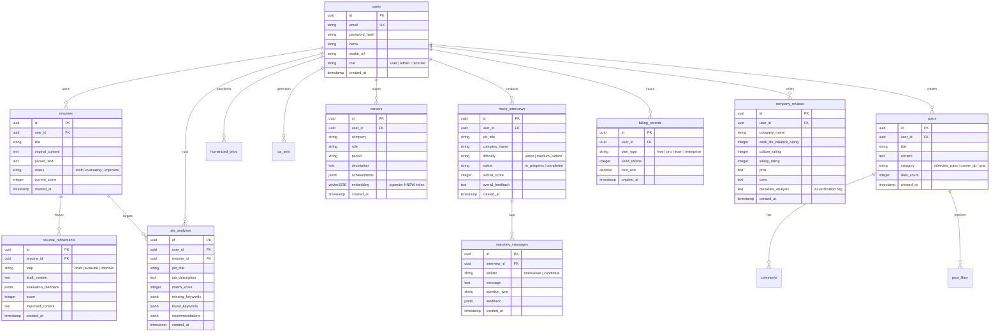

#  Kairos AI Platform — 통합 마스터 개발 실행 계획서 (Master Execution Plan)

> **문서 성격**: 기획서 폴더 내 15개 문서를 완벽히 총망라한 구체 실무적 개발 실행 로드맵  
> **핵심 슬로건**: "당신의 커리어 전 생애를 기억하고, 분석하고, 대신 행동하는 AI — Kairos"  
> **핵심 기술 스택**: Nuxt 4 (Hybrid SPA) + Astro (Island Architecture) + Neon PostgreSQL (pgvector HNSW) + Redis Cloud (Upstash Semantic Cache) + Vercel AI SDK v7 + Tauri v2 + React Native Expo

---

## 1. 아키텍처 및 데이터베이스 ERD 설계

### 1.1 하이브리드 아키텍처 레이어

```mermaid
graph TD
    subgraph Client Layer
        AstroWeb["Astro 4 Web (Islands / SSG / ISR) - SNS, Blog, Landing"]
        NuxtWeb["Nuxt 4 Web (Hybrid SPA / SSR) - Resume Studio, Mock Interview"]
        TauriDesktop["Tauri v2 Desktop App (Rust + Webview) - Local HWP/File Access"]
        ExpoMobile["React Native Expo App (iOS/Android) - STT/TTS Interview"]
        BrowserExt["Chrome Extension (Manifest V3) - Job Scraping"]
        VSCodeExt["VS Code Extension - Git Commit Summary"]
        CliTool["Agent CLI (Node.js/Go) - Terminal Workflows"]
    end

    subgraph Server & API Layer (Nitro Serverless)
        BetterAuth["Better Auth (Session/OAuth)"]
        RateLimiter["Upstash Redis Rate Limiter"]
        AISDK["Vercel AI SDK v7 Engine (Extended Thinking)"]
        Guardrail["Layer 1-4 Guardrail Engine (Async Verification)"]
    end

    subgraph Data & Cloud Layer
        NeonDB[("Neon Postgres + pgvector (HNSW Indexing)")]
        RedisCloud[("Redis Cloud (Session, Upstash Semantic Cache)")]
        CloudflareR2["Cloudflare R2 / Vercel Blob (PDF/HWP Storage)"]
    end

    Client Layer -->|HTTPS / WSS / SSE| Server & API Layer
    Server & API Layer --> NeonDB
    Server & API Layer --> RedisCloud
    Server & API Layer --> CloudflareR2
```

---

### 1.2 상세 데이터베이스 ERD (Drizzle ORM & pgvector)

Kairos의 DB는 core career 데이터, AI 파이프라인, 채용 인텔리전스, 커뮤니티 SNS, 결제/사용량 5개 핵심 구역으로 구성됩니다.



---

## 2. PHASE별 구체 실무 개발 실행 로드맵

---

###  PHASE 1: D-2 예선(7/31) 긴급 시연 & 프로덕션 10대 갭 1차 해결

> **목표**: 7/31 예선 3분/5분 라이브 시연 완벽 수행 및 기존 코드베이스의 10대 프로덕션 갭 즉시 보원.

#### 1.1 긴급 코드 수정 (Immediate Bugs & Production Gaps)
- [ ] **`llmCache` Nitro Alias 누락 수정**: `nuxt.config.ts`에 `alias: { '~/server/services/llmCache': ... }` 설정 추가 및 빌드 워닝 제거.
- [ ] **`setCachedResponse` 캐시 쓰기 연결**: `server/api/llm/refine.post.ts` 내 AI 호출 성공 후 Upstash Redis에 캐시 저장 로직 복구.
- [ ] **`vercel.json` Rewrite 정리**: Nitro API 라우트 와일드카드와 충돌하는 레거시 rewrite 규칙 제거.
- [ ] **에러 UI 전환 (`alert()` → `UToast`)**: `app/pages/resume/[id].vue`, `app/pages/interview/[id].vue` 등의 `alert()` 구문을 Nuxt UI `useToast()`로 교체.
- [ ] **`.env.example` 동기화**: `GOOGLE_API_KEY`, `UPSTASH_VECTOR_REST_URL`, `UPSTASH_VECTOR_REST_TOKEN` 등 환경변수 템플릿 최신화.

#### 1.2 D-2 예선 시연 데이터 & 백업 시스템 준비
- [ ] **Neon pgvector 시연용 데이터 주입**: 백엔드/프론트엔드/PM 직군 샘플 이력서 3종 및 잡코리아/사람인 채용공고 5개 사전 임베딩.
- [ ] **로컬 SQLite / IndexedDB 백업 시나리오**: API 지연 및 네트워크 차단 시 오프라인 모드로 즉시 전환하여 캐시된 면접 세션을 보여주는 안전 장치 검증.
- [ ] **예선 PPT 8슬라이드 및 대본 최종 마감**: `PPT_8슬라이드_초안.md` 및 `데모_시연_대본.md` 기반 발표 리허설 진행.

---

###  PHASE 2: D-10 본선(8/8) 대응 — 프론트엔드 하이브리드 & AI SDK v7 에이전트 고도화

> **목표**: Astro (Islands) + Nuxt 4 (Hybrid SPA) 물리적 이중 쉘 완성 및 Vercel AI SDK v7 기반 5대 에이전트 루프 구축.

#### 2.1 프론트엔드 하이브리드 렌더링 계층 구축
- [ ] **Astro Islands 포팅**:
  - `r/*` 커뮤니티 SNS 피드 및 기업 채용 정보 페이지를 Astro SSG/ISR로 분리.
  - `client:visible` 하이드레이션을 통한 LCP < 1.2초 달성.
- [ ] **Nuxt 4 SPA 고도화**:
  - 이력서 고도화 스튜디오 (`app/pages/resume/[id].vue`) drag-and-drop UI 및 실시간 파싱(PDF.js / Mammoth) 최적화.
  - CUI 인터페이스를 Floating Side Panel로 이동시키고, **AI Thinking Process Bubble** 및 처리 단계(1/3, 2/3) 시각화 UI 구현.

#### 2.2 AI SDK v7 5대 에이전트 루프 구현
- [ ] **이력서 고도화 에이전트 (Evaluator-Optimizer)**:
  - `Draft (Haiku)` → `Evaluate (알고리즘 + LLM)` → `Improve (Claude Opus Extended Thinking)` 3단계 루프 (최대 3회 반복).
- [ ] **AI 모의 면접관 (ReAct + SSE Streaming)**:
  - `server/api/interviews/[id]/chat.post.ts`에 `streamText` 및 STAR 프레임워크 유도 프롬프트 통합.
- [ ] **ATS 채용공고 매칭 엔진 (Prompt Chaining & Vector HNSW)**:
  - JD 텍스트 vs 사용자 이력서 pgvector 코사인 유사도 연산 + missing/found 키워드 칩 생성.
- [ ] **AI 문장 휴머나이저 (Reflection)**:
  - 진부한 AI 어조 제거 및 능동형 문장 자가 비평 재생성.
- [ ] **4계층 가드레일 (Layer 1-4 Guardrail Engine)**:
  - Upstash Redis 분당 요청 제한(Rate Limit) 및 사후 비동기 환각/PII 검증 파이프라인 탑재.

---

###  PHASE 3: B2B2C 채용 인텔리전스 & 커뮤니티(SNS) & MCP 에이전트 허브

> **목표**: 잡코리아 x 사람인 x Reddit 융합 메타 데이터 파이프라인 구축 및 MCP (Model Context Protocol) 연동.

#### 3.1 채용 인텔리전스 & 커뮤니티 레이어 (`company_reviews`, `posts`)
- [ ] **기업 메타 정보 파서**: 기업 공고 뒤의 실제 워라밸/문화를 Reddit식 익명 후기와 결합하여 인사이트 추출.
- [ ] **커리어 성장 SNS 피드**:
  - 면접 합격 배지 (NFT/인증 인디케이터) 공유 기능.
  - 사용자 성장 타임라인 및 멘토-멘티 연결 채널 제공.
- [ ] **공공 데이터 MCP 허브 연동**:
  - 워크넷(WorkNet), 고용24, 산업인력공단 MCP 커넥터 구축.
  - Google Drive, Notion, Obsidian 로컬 지식베이스 Sync API 작성.

---

###  PHASE 4: 멀티플랫폼 모노레포 구축 (Desktop, Mobile, Extensions, CLI)

> **목표**: Core-Shell 구조의 Turborepo 모노레포 환경에서 6대 타깃 플랫폼 빌드 파이프라인 가동.

#### 4.1 플랫폼별 Shell 구축
- [ ] **Tauri v2 Desktop App (Rust + Webview)**:
  - Windows/macOS용 초경량 (10MB) 빌드.
  - Rust 네이티브 FFI를 통한 로컬 HWP/HWPX 문서 직접 파싱 및 오프라인 SQLite 캐싱.
- [ ] **React Native Expo Mobile App**:
  - iOS/Android 네이티브 음성 STT/TTS 모의면접 UI 구성.
  - `expo-secure-store` 기반 암호화 토큰 보관 및 푸시 알림(FCM) 구현.
- [ ] **Chrome Extension (Manifest V3)**:
  - 사람인/잡코리아 채용공고 페이지 DOM 파싱 및 Kairos ATS 스코어 오버레이 UI.
- [ ] **VS Code Extension (VSX)**:
  - Git commit 로그 성과 요약 및 `/Kairos: Record Today's Work` 커맨드 팔레트.
- [ ] **Agent CLI (Node.js/esbuild)**:
  - `kairos resume push`, `kairos status`, `kairos interview` 대화형 터미널 툴.

---

### ️ PHASE 5: 공익성 데이터 서비스 & 자동 마진 제어 / Web3 결제

> **목표**: 지자체/대학용 스킬 갭 리포트 시스템 구축 및 B2B/B2C 비용 보호 자동마진장치 완성.

#### 5.1 공익성 청년 고용 스킬 갭 분석 시스템
- [ ] **대학/지자체 대시보드 API**: 학과별/지역별 보유 스킬 vs 시장 요구 스킬 갭 통계 집계.
- [ ] **자동마진장치 (Auto-Margin System)**:
  - 사용자별 LLM 비용 실시간 추적 (`@ai-sdk/otel`).
  - 80% / 100% 임계치 도달 시 경고 메일 자동 발송 (`server/services/marginControl.ts`).
  - Redis Semantic Cache (코사인 유사도 0.96 이상) 적용으로 API 연산 비용 90% 차단.
- [ ] **Web3 블록체인 결제 (초초 베타)**:
  - Polygon (EVM) 상의 Solidity `KairosSubscription.sol` 스마트 컨트랙트 작성 및 MetaMask / USDC 연동.

---

###  PHASE 6: 독점 커리어 OS 생태계 완성 & AI 예측 모델 튜닝

> **목표**: 경력/이직 예측 AI 엔진 구축 및 B2B HR 솔루션 파이프라인 개방.

- [ ] **커리어 경로 예측 모델**: 누적된 이력서/면접 결과 데이터를 기반으로 한 이직 성공률 & 연봉 상승률 예측 RAG.
- [ ] **기업 HR 통합 관리 솔루션**: 기업 채용 담당자용 AI 면접관 세팅 및 후보자 평가 대시보드.
- [ ] **글로벌 다국어 (i18n) & WCAG AA 접근성 검증**: `@nuxtjs/i18n` 연동 및 스크린 리더 호환성 100% 확보.

---

## 3. 검증 및 테스팅 계획 (Verification Plan)

### 3.1 자동화 테스트 (Automated Testing)
- **단위 테스트 (Vitest)**: `useClientAI`, `llmCache`, `semanticCache`, `drizzle-orm` 스키마 쿼리 100% 검증.
- **E2E 테스트 (Playwright)**:
  - 이력서 업로드 → ATS 분석 → AI 모의면접 SSE 스트리밍 플로우 검증.
  - 네트워크 끊김 시 IndexedDB 백업 및 복구 테스트.

### 3.2 수동 검증 & 시연 리허설 (Manual Verification)
- **7/31 예선 시연 3분/5분 타임라인 리허설** (3회 이상 완주).
- **Tauri v2 HWP 파싱 & Expo 모바일 STT 음성 입력 실기기 검증**.
