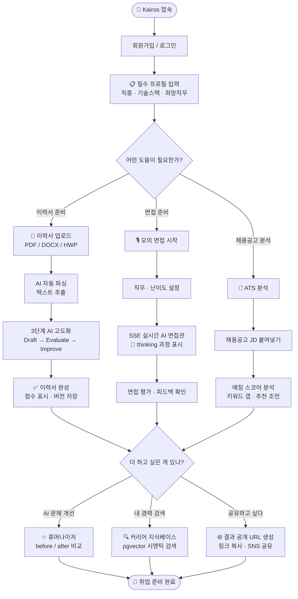

# 페르소나 카드 + 사용자 이용 흐름

> **작성일**: 2026-07-29  
> **용도**: PPT 슬라이드 3번(문제/페르소나), 5번(사용자 흐름) 기반 자료  
> **참조**: `기획_완성도_진단.md` — 0% 항목 해소

---

## 페르소나 카드

> 팀에서 한 명을 최종 확정할 것. 여기서는 B2C 핵심 타겟 1명만 쓴다.

---

### 🎓 페르소나 A — 취업준비생 (B2C 핵심)

```
┌──────────────────────────────────────────────────────┐
│                                                      │
│  👤 이수민   23세   경기도 수원   컴퓨터공학과 4학년  │
│                                                      │
│  목표: IT 기업 SW 개발자 취업 (3개월 안에)            │
│  현재: 지원 10곳 / 서류 통과 1곳 / 최종 합격 0곳     │
│                                                      │
│  ──────────────────────────────────────────────────  │
│                                                      │
│  💢 Pain Point 1 — 기억                              │
│  "이력서가 PC에 8개 버전으로 흩어져 있어요.           │
│   뭘 고쳤는지도 모르겠고, 어떤 게 최신인지도 몰라요"  │
│                                                      │
│  💢 Pain Point 2 — 맥락                              │
│  "ChatGPT한테 자소서 도움 받으려면                    │
│   매번 내 경력을 처음부터 다시 설명해야 해요.          │
│   그게 너무 귀찮아서 결국 혼자 씁니다"                │
│                                                      │
│  💢 Pain Point 3 — 피드백                            │
│  "면접에서 떨어졌는데 왜 떨어졌는지 모릅니다.          │
│   내가 뭘 잘못 말했는지, 뭘 보완해야 하는지           │
│   아무도 알려주지 않아요"                             │
│                                                      │
│  ──────────────────────────────────────────────────  │
│                                                      │
│  ✨ Kairos 사용 후                                   │
│  → AI가 5년치 경험을 기억, 면접 합격률 체감 상승     │
│  → 취업 준비 기간: 6개월 → 3개월 목표               │
│                                                      │
└──────────────────────────────────────────────────────┘
```

---

### 🏢 페르소나 B — 이직 준비 경력자 (B2C 잠재)

```
┌──────────────────────────────────────────────────────┐
│                                                      │
│  👤 박지훈   31세   경기도 성남   5년 차 백엔드 개발자│
│                                                      │
│  목표: 대기업 또는 유니콘 스타트업으로 이직           │
│  현재: 야근 중이라 이직 준비할 시간이 절대적으로 부족  │
│                                                      │
│  ──────────────────────────────────────────────────  │
│                                                      │
│  💢 Pain Point 1 — 정리 안 된 경력                   │
│  "5년치 프로젝트, 성과, 기술 성장이                   │
│   정리된 곳이 없어요. 포폴 쓸 때마다                  │
│   '내가 뭘 했더라' 기억이 안 납니다"                 │
│                                                      │
│  💢 Pain Point 2 — 시간 부족                         │
│  "퇴근하면 11시예요.                                 │
│   면접 준비할 시간이 없습니다.                        │
│   AI가 대신해줬으면 좋겠어요"                        │
│                                                      │
│  💢 Pain Point 3 — 시장 감각 없음                    │
│  "지금 이 직무가 얼마나 경쟁률이 높은지,              │
│   내 이력서가 ATS를 통과하는지조차 모릅니다"          │
│                                                      │
│  ✨ Kairos 사용 후                                   │
│  → 에이전트가 채용공고 자동 수집·분석               │
│  → 이동 시간에 모바일로 AI 면접 연습                │
│                                                      │
└──────────────────────────────────────────────────────┘
```

> **발표 선택**: 슬라이드에는 **페르소나 A (이수민)** 한 명만 사용하되,  
> Q&A에서 이직자 케이스 질문이 나올 경우 페르소나 B로 답변.

---

## 사용자 이용 흐름 (User Flow)

### 흐름도 — Mermaid 다이어그램



---

### 흐름 설명 (발표자용 단순 버전)

```
[가입] → [프로필 입력]
    ↓
[이력서 업로드 · AI 고도화]
    ↓
[ATS 채용공고 분석]  ←→  [AI 모의 면접]
    ↓
[키워드 보완 · 피드백 반영]
    ↓
[AI 휴머나이저로 문체 개선]
    ↓
[최종 이력서 완성 · SNS 합격 공유]
```

---

### 핵심 흐름 포인트 (발표 시 강조)

1. **한 번 프로필 입력하면 AI가 내 맥락을 기억** — 다음부터는 설명 불필요
2. **이력서·면접·ATS가 연결됨** — 면접 피드백이 이력서 개선에 반영
3. **결과물에 고유 URL 생성** — ChatGPT처럼 결과를 공유할 수 있음
4. **커리어 지식베이스가 쌓임** — 쓸수록 AI가 나를 더 잘 안다

---

## 경쟁사 비교표 (슬라이드 2번 또는 보조자료)

| 비교 항목 | ChatGPT | 자소설닷컴 | **Kairos** |
|---------|:-------:|:--------:|:---------:|
| 내 커리어 기억 | ❌ 매번 처음 | ❌ | ✅ **pgvector 영구 기억** |
| 이력서 버전 관리 | ❌ | △ 저장만 | ✅ **3단계 히스토리** |
| 실시간 면접 시뮬 | ❌ | ❌ | ✅ **SSE 스트리밍** |
| AI thinking 표시 | ❌ | ❌ | ✅ **처리 과정 UI** |
| ATS 통과율 분석 | ❌ | ❌ | ✅ **JD 실시간 비교** |
| 오프라인 작동 | ❌ | ❌ | ✅ **PWA + IndexedDB** |
| 커리어 SNS 연결 | ❌ | ❌ | ✅ **성장자극 네트워크** |
| 에이전트 자동 실행 | ❌ | ❌ | ✅ **MCP 기반 대리** |

> **발표 활용**: "기존 서비스와 8가지가 다릅니다" — 창의성(20점) 공략

---

*작성일: 2026-07-29 | 대회 본선: 2026-08-08*
